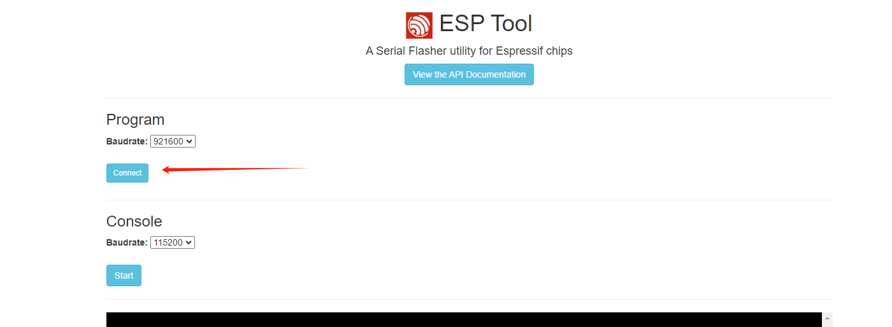
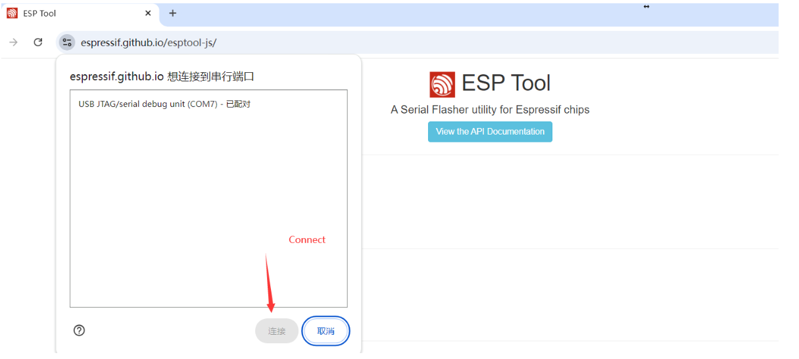
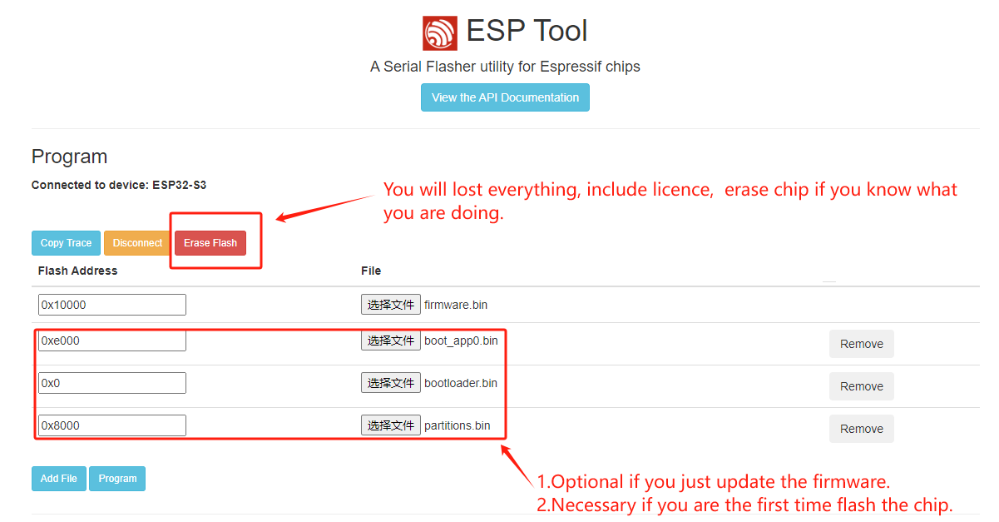

# NMMiner - New ESP32 Solo Miner
- BTC solo miner.
- Deeply optimazion for ESP32-S3: Achieves high performance of 120kH/s with a single chip in solo miner mode, while maintaining low power consumption.

## Requirements
- ESP32s3 boards from [heltec](https://heltec.org/project/vision-master-t190/) as so far.
- [Putty](https://www.putty.org/) (optional, web monitor instead since [v0.2.11](#20240827---v0211))
- 3D BOX (in progress, coming soon)

## Features
- Deeply optimazation for ESP32-S3, max hashrate: 119 KH/s
- NMController_client, [source code](https://github.com/NMminer1024/NMController_client), we put the *_x64.msi and *_x86.msi in tool folder already, just install, only for Windows
- NMController_web, [source code](https://github.com/NMminer1024/NMController_web), it's a Python implement, for Windows and Mac.

  

  

- The testing hashrate from the public-pool:

  

### Buttons

| Buttons           | Action             | Description             |
| :---------------  | :-----------------:|:-----------------:      |
|user               | Single click       |  Screen wake up         |
|user               | Double click       |  Switch to next screen  |
|user               | [Press and hold before reset](#normal-configuration)  |  Miner Configuration    |
|boot               | Long press         |  Clear all status from nvs(if enabled this feature)  |
|boot               | Single click       |  Screen wake up         |

### NMMiner Configuration
***
#### Initiation configuration

1. When the device is powered on, it will connect to the last WiFi connected by default. If it fails to connect to this WiFi after trying for 10s, it will automatically enter the configuration mode.

2. Search for AP named: nmap-2.4g, enter password: 12345678

3.  If connect to AP via mobile phone and everything goes well, you will be redirected to the configuration page; if connect to AP via PC, just log in: 192.168.4.1.

  

4. You will see the following page. Follow the steps to configure your mining machine. The larger the UI refresh value, the higher the hash rate, and the hash rate will also increase when the screen is turned off.

  

5. You can return to the configuration page at any time and refer to the [button](#buttons) operations.

6. In some areas, the pool is blocked by the local firewall. If you have an SSL encrypted channel, you can enable this option.

7. When you click **Save** it will take a while (10-15 seconds), do not reset the miner manually, just let it restart automatically.

#### Force configuration

1. Press and hold the **User** button, then click the **Reset** button, wait until the QR code appears(screen board required), then release the **User** button.

2. Then follow [Initiation configuration](#Initiation-configuration)

  

***
#### firmware update
- Please confirm that the firmware folder contains support for the ESP32 board you have.
- We use the T190 hardware as an example here:

 **Step 1**: open online **'[ESP Tool](https://espressif.github.io/esptool-js/)'**, connect your Miner to your computer, then click **Connect**.

  

**Step 2**: Then will pop up a window to choose your ESP32-S3 device, and Connect it.

  

**Step 3**: Add the NMMiner firmware file from your device Model Path, flash Address at 0x10000.

  

**Step 4**: Update the firmware

  

- **Q&A:** If some errors occur when you update the firmware, one of the solutions as follow: 

    a). Hold **boot** button;

    b). Wait 1s;

    c). Then click **reset** button;

    d). Wait 1s;

    e). Release **boot** button;

    f). Click **Program** button on **'[ESP Tool](https://espressif.github.io/esptool-js/)'** page.

## Pool
- Due to the very limited on-chip resources of the ESP32, some high-difficulty mining pools currently reject our connections. [public-pool.io](https://web.public-pool.io/) is a mining pool that accepts low-difficulty miners. We appreciate their efforts.

## How to monitor

- In fact, both ***NMController_client*** and ***NMController_web*** have the same feature, ***NMController_client*** for Windows, ***NMController_web*** for Windows and MACOS, We make an example by ***NMController_client*** here.

- ***NMController_client***, scan the machine in your LAN, just as below.

  

- Redirect to the web monitor for more details. 

  

  

##  Board support:
  - [Heltec Vision Master T190](https://www.aliexpress.us/item/1005007449552504.html)
  - [Heltec WiFi lora 32 v3](https://www.aliexpress.com/item/1005005443005152.html)
  - [Heltec wireless stick lite v3](https://heltec.org/project/wireless-stick-lite-v2/)
  - [Heltec Wifi kit 32 v3](https://heltec.org/project/wifi-kit32-v3/)
  - [all_usbcdc_screenless_esp32s3fn8](https://heltec.org/project/wifi-kit32-v3/)

##  Get a License :
  - We provide a license to make our firmware running on other board, it would be better that it's a screenless one and esp32s3FN8 or esp32s3R8 on board. 
  - [License](http://license.nmminer.shop)

## Contact
- We are committed to supporting more models of Arduino development boards.
- Anything do not work as your expectation, just let us know.

| Email                   |  Telegram                       |
| :-----------------:     |  :-----------------:            |
|nmminer1024@gmail.com    |  https://t.me/+IYFC1D0al1E5Yjdl |

##  Useful documentation:

- [Solominer](https://github.com/iceland2k14/solominer/blob/main/solo_miner.py)
- [pyminer.py](https://github.com/jgarzik/pyminer/blob/master/pyminer.py)
- [Stratum Protocol](https://reference.cash/mining/stratum-protocol)
- [Stratum Protocol Diagram](https://github.com/aeternity/protocol/blob/master/STRATUM.md)
- [NBits](https://learnmeabitcoin.com/technical/bits)
- [Bitcoin Mining](https://www.righto.com/2014/02/bitcoin-mining-hard-way-algorithms.html)
- [How To Mine](https://gist.github.com/Ending2015a/70373b2f6f665a765b4d0b0c427f052b)
- [Image Converter 565](http://www.rinkydinkelectronics.com/t_imageconverter565.php)
- [Lilygo-T-Display-S3](https://github.com/Xinyuan-LilyGO/T-Display-S3/tree/main)
- [HAN](https://github.com/valerio-vaccaro/HAN)
- [NerdMinerv2](https://github.com/BitMaker-hub/NerdMiner_v2)
- [Jade](https://github.com/Blockstream/Jade/tree/miner_all_0.1.47/components/miner)
- [LeafMiner](https://github.com/matteocrippa/leafminer)

## Release Log

### (2024.09.23) - v0.3.02
- Add:
  - Web ESP-Tool.
  - Support chip, esp32fn8.
- Fixed:
  - None
- Improved:
  - None.
- Baord support
  - [Heltec Vision Master T190](https://www.aliexpress.us/item/1005007449552504.html)
  - [Heltec WiFi lora 32 v3](https://www.aliexpress.com/item/1005005443005152.html)
  - [Heltec wireless stick lite v3](https://heltec.org/project/wireless-stick-lite-v2/)
  - [Heltec Wifi kit 32 v3](https://heltec.org/project/wifi-kit32-v3/)
  - [all_usbcdc_screenless_esp32s3fn8](https://heltec.org/project/wifi-kit32-v3/)

### (2024.09.14) - v0.3.02
- Add:
  - License.
- Fixed:
  - None
- Improved:
  - Automatically enter configuration mode.
- Baord support
  - [Heltec Vision Master T190](https://www.aliexpress.us/item/1005007449552504.html)
  - [Heltec WiFi lora 32 v3](https://www.aliexpress.com/item/1005005443005152.html)
  - [Heltec wireless stick lite v3](https://heltec.org/project/wireless-stick-lite-v2/)
  - [Heltec Wifi kit 32 v3](https://heltec.org/project/wifi-kit32-v3/)

### (2024.09.08) - v0.3.01
- Add:
  - None
- Fixed:
  - Readme.md
- Improved:
  - None
- Baord support
  - [Heltec Vision Master T190](https://www.aliexpress.us/item/1005007449552504.html)
  - [Heltec WiFi lora 32 v3](https://www.aliexpress.com/item/1005005443005152.html)

### (2024.09.02) - v0.3.01
- Add:
  - Tool, [***NMController***](https://github.com/NMminer1024/NMController), Something like a LAN centralized monitoring client, Windows 10 or higher require.
  - Firmware, mining status broadcast to LAN. 
- Fixed:
  - None
- Improved:
  - None
- Baord support
  - [Heltec Vision Master T190](https://www.aliexpress.us/item/1005007449552504.html)
  - [Heltec WiFi lora 32 v3](https://www.aliexpress.com/item/1005005443005152.html)

### (2024.09.02) - v0.2.13
- Add:
  - None
- Fixed:
  - License disappear issue when return to configuration page.
- Improved:
  - None
- Baord support
  - [Heltec Vision Master T190](https://www.aliexpress.us/item/1005007449552504.html)
  - [Heltec WiFi lora 32 v3](https://www.aliexpress.com/item/1005005443005152.html)

### (2024.08.31) - v0.2.12
- Add:
  - None
- Fixed:
  - Device would occasionally restart frequently when connecting to WiFi at startup.
- Improved:
  - None
- Baord support
  - [Heltec Vision Master T190](https://www.aliexpress.us/item/1005007449552504.html)
  - [Heltec WiFi lora 32 v3](https://www.aliexpress.com/item/1005005443005152.html)

### (2024.08.27) - v0.2.11
- Add:
  - Web Monitor, makes it easy to monitor your machine without any special client tools. You only need a phone or computer's browser.
  - Heltec WiFi lora 32 v3 firmware
- Fixed:
  - Some issues from WiFi.
- Improved:
  - Memory management.
  - Almost reaching 120KH/s when USB CDC disable.
- Baord support
  - [Heltec Vision Master T190](https://www.aliexpress.us/item/1005007449552504.html)
  - [Heltec WiFi lora 32 v3](https://www.aliexpress.com/item/1005005443005152.html)
- Next
  - Some screenless board support.

### (2024.08.15) - v0.2.10
- Features:
  - BTC solo miner base on esp32s3 series 
  - Up to **118kH/s** 
  - ssl connection support
  - Screen auto off in 60s
  - Real time clock
  - Configuration on websever, it's easy enough to build your first BTC Miner.
  - WiFi signal strength on screen.
- Fixed:
  - Memory leak issues.
  - Stratum nBits sector parse issues.
- Modify:
  - None
- Baord support
  - [Heltec Vision Master T190](https://www.aliexpress.us/item/1005007449552504.html)

### (2024.08.13) - v0.2.02
- Features:
  - BTC solo miner base on esp32s3 series 
  - Up to **118kH/s** 
  - ssl connection support
  - Screen auto off in 60s
  - Real time clock
  - Configuration on websever, it's easy enough to build your first BTC Miner.
  - WiFi signal strength on screen.
- Fixed:
  - Mining status clean issues.
- Modify:
  - None
- Baord support
  - [Heltec Vision Master T190](https://www.aliexpress.us/item/1005007449552504.html)

### (2024.08.10) - v0.2.01
- Features:
  - BTC solo miner base on esp32s3 series 
  - Up to **118kH/s** 
  - ssl connection support
  - Screen auto off in 60s
  - Real time clock
  - Configuration on websever, it's easy enough to build your first BTC Miner.
  - WiFi signal strength on screen.
- Fixed:
  - **Configuration of user BTC address not effective issue.**
- Modify:
  - Contact us, telegram group add.
  - Modify firmware update tools, make it easy to update firmware.
- Baord support
  - [Heltec Vision Master T190](https://www.aliexpress.us/item/1005007449552504.html)

### (2024.08.09) - v0.1.55
- Features:
  - BTC solo miner base on esp32s3 series 
  - Up to **118kH/s** 
  - ssl connection support
  - Screen auto off in 60s
  - Real time clock
  - Configuration on websever, it's easy enough to build your first BTC Miner.
  - WiFi signal strength on screen.
- Fixed:
  - Some ssl issues.
- Modify:
  - Add some log on loading screen.
  - Hashrate upto 118K when screen off.
- Baord support
  - [Heltec Vision Master T190](https://www.aliexpress.us/item/1005007449552504.html)

### (2024.08.02) - v0.1.54
- Features:
  - BTC solo miner base on esp32s3 series 
  - Up to **117kH/s** 
  - ssl connection support
  - Screen auto off in 60s
  - Real time clock
  - Configuration on websever, it's easy enough to build your first BTC Miner.
  - WiFi Signal Strength add.
- Fixed:
  - Some issues after full chip erase.
- Modify:
  - None
- Baord support
  - [Heltec Vision Master T190](https://www.aliexpress.us/item/1005007449552504.html)

### (2024.08.01) - v0.1.53
- Features:
  - BTC solo miner base on esp32s3 series 
  - Up to **117kH/s** 
  - ssl connection support
  - Screen auto off in 60s
  - Real time clock
  - Configuration on websever, it's easy enough to build your first BTC Miner.
  - WiFi Signal Strength add.
- Fixed:
  - Fixed default WiFi parameters issues.
  - Fixed parameter of 'screen off time out'.
- Modify:
  - Some nvs handles, not compatible with v0.1.52.
- Baord support
  - [Heltec Vision Master T190](https://www.aliexpress.us/item/1005007449552504.html)

### (2024.07.31) - v0.1.52
- Features:
  - BTC solo miner base on esp32s3 series 
  - Up to **117kH/s** 
  - ssl connection support
  - Screen auto off in 60s, can be setted from the Configuration Page
  - Real-time clock
  - Configuration on webserver, it's easy enough to build your first BTC Miner.
- Fixed:
  - First push 
- Modify:
  - None
- Board support
  - [Heltec Vision Master T190](https://www.aliexpress.us/item/1005007449552504.html)
