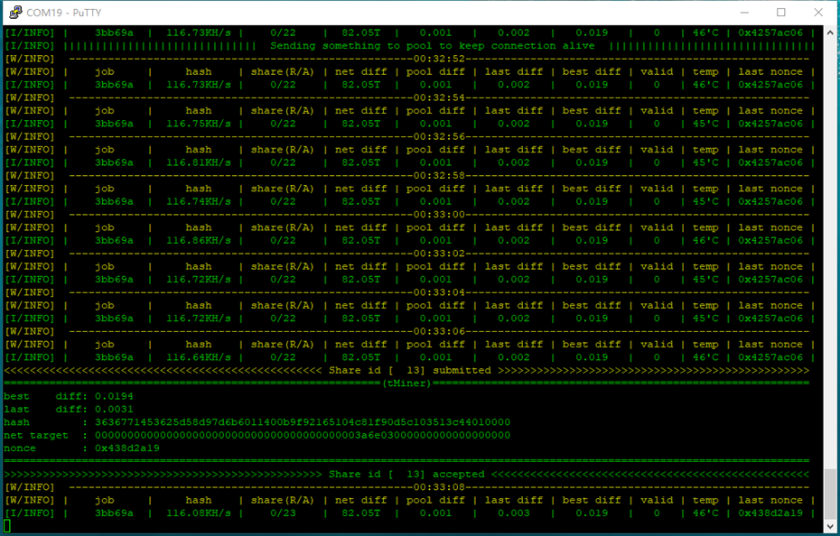
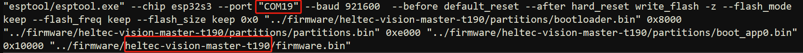
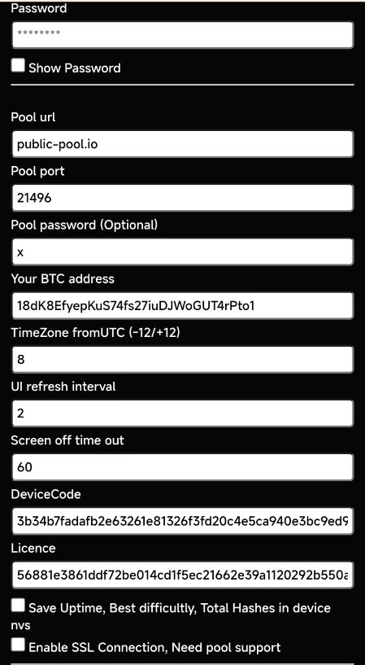

# NMMiner - New ESP32 Solo Miner

- Deeply Optimazion for ESP32-S3: Achieves high performance of 117kH/s with a single chip in solo miner mode, while maintaining low power consumption.

## Requirements

- [Heltec Vision Master T190](https://www.aliexpress.us/item/1005007449552504.html)
- Putty
- 3D BOX (not supported now, coming soon)

## Features

- SHA256d deeply Optimazation for ESP32-S3, max hashrate: 117 KH/s

  

The testing Hashrate from the public-pool:

## Install and Start

### Flash Binary

- Download the binary file, just click **tool/download.bat** if you have got a correct board.

  Following items should be adjust to fit your environment first before execute **download.bat**：

  

- Please wait patiently for the download to be completed.

- If it's the first time you download the firmware, you may got a configuration request on screen to remind you config the miner. just config it as [NMMiner Configuration](#nmminer-configuration)

- Open a tool something like **putty**, the machine log will rolling in putty.

### Buttons

| Buttons           | Action             | Description             |
| :---------------  | :-----------------:|:-----------------:      |
|user               | Single click       |      Screen wake up     |
|user               | Double click       |  Switch to next screen    |
|user               | Hold on when power on       |      Miner Configuration      |
|boot               | Long press after boot       |  Clear all status in nvs(if enabled this feature)  |

### NMMiner Configuration

1. Hold on the **user** button, then reset, wait until a QR code appeared.

  

2. Seach a AP named: nmap-2.4g, pwd: 12345678

3. Connect the AP via your phone, if everything goes well, it will jump to the configuration page directly.

4. Connect the AP via a PC, just login to: 192.168.4.1

5. Keep all parameters default except BTC address and wifi.

  

6. You can back to the configuration page anytime via a action hold on the user button when power on.

7. Enabled the SSL option if you know what you did.

## How to Usage

ESP32 implementing Stratum protocol to mine on solo pool. Pool can be changed but originally works with [public-pool.io](https://web.public-pool.io/)

## Contact
- We are committed to supporting more models of Arduino development boards.
- Anything not work as your expectation, just let us know.

| Email                   |
| :-----------------:     |
|nmminer1024@gmail.com    |

## Release Log
### (2024.07.31) - v0.1.52
- Features:
  - BTC solo miner base on esp32s3 series 
  - Up to **117kH/s** 
  - ssl connection support
  - Screen auto off in 60s, can be setted from the Configuration Page
  - Real-time clock
  - Configuration on webserver, it's easy enough to build your first BTC Miner.
- Fixed:
  - First push 
- Modify:
  - None
- Board support
  - [Heltec Vision Master T190](https://www.aliexpress.us/item/1005007449552504.html)
