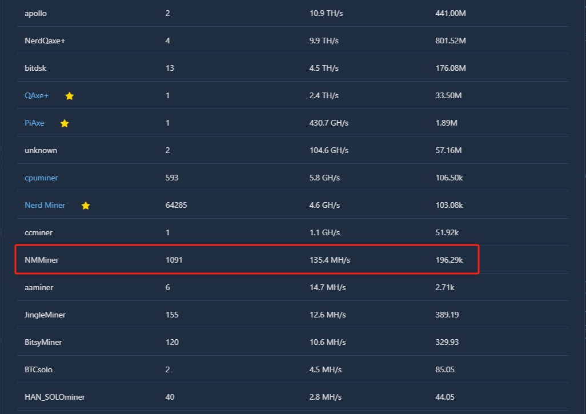

# NMMiner - New ESP32 Solo Miner

- Deeply optimazion for ESP32-S3: Achieves high performance of 117kH/s with a single chip in solo miner mode, while maintaining low power consumption.

## Requirements

- [Heltec Vision Master T190](https://www.aliexpress.us/item/1005007449552504.html)
- [Putty](https://www.putty.org/)
- 3D BOX (not supported now, coming soon)

## Features

  

- SHA256d deeply optimazation for ESP32-S3, max hashrate: 117 KH/s

  

- The testing Hashrate from the public-pool:

  

### Buttons

| Buttons           | Action             | Description             |
| :---------------  | :-----------------:|:-----------------:      |
|user               | Single click       |      Screen wake up     |
|user               | Double click       |  Switch to next screen    |
|user               | Hold on before reset       |      Miner Configuration      |
|boot               | Long press after startup   |  Clear all status in nvs(if enabled this feature)  |

### NMMiner Configuration
***
#### Normal configuration

1. Hold on the **user** button don't release, then click **reset** button, wait until a QR code appeared, release the **user** button.

  

2. Seach a AP named: nmap-2.4g, pwd: 12345678

3. Connect the AP via your phone, if everything goes well, it will jump to the configuration page directly.

  

4. Connect the AP via a PC, just login to: 192.168.4.1

5. You can see a page as below, config your Miner follow the step, the large the UI refresh value is, the higher hashrate will, and also hashrate will be improved when screen off.

  

6. You can back to the configuration page anytime, reference [button actions](#buttons).

7. Enabled the SSL option if you know what you did.

8. It will take a little bit long(10-15s) when you click the **SAVE**, don't reset the Miner manually, just let it auto reboot.
***
#### firmware update

- Open the dir **'firmware/heltec-vision-master-t190'**, connect your Miner to your computer, then try to click **fw_update.exe**.

  

- It would be better that there is only one COM port on your computer, **fw_update.exe** search the COM list on your computer and select the largest COM port index as the target port. So if there are more than one COMx, make sure the T190 COM port index is the largest one on your computer, just as below：

  

- If some error occur when you update the firmware as below, one of the solutions as follow: 

##### Error:

  

##### solutions:

  a). Hold on **boot** button;

  b). Wait 1s;

  c). Then click **reset** button;

  d). Wait 1s;

  e). Release **reset** button;

  f). Wait 1s;

  g). Release **boot** button;

  h). Click **fw_update.exe**.

## How to Usage

- ESP32 implementing stratum protocol to mine on solo pool. Pool can be changed but originally works with a low difficulty pool [public-pool.io](https://web.public-pool.io/).

## Contact
- We are committed to supporting more models of Arduino development boards.
- Anything do not work as your expectation, just let us know.

| Email                   |  Telegram                       |
| :-----------------:     |  :-----------------:            |
|nmminer1024@gmail.com    |  https://t.me/+IYFC1D0al1E5Yjdl |

##  Useful documentation:

- [Solominer](https://github.com/iceland2k14/solominer/blob/main/solo_miner.py)
- [pyminer.py](https://github.com/jgarzik/pyminer/blob/master/pyminer.py)
- [Stratum Protocol](https://reference.cash/mining/stratum-protocol)
- [Stratum Protocol Diagram](https://github.com/aeternity/protocol/blob/master/STRATUM.md)
- [NBits](https://learnmeabitcoin.com/technical/bits)
- [Bitcoin Mining](https://www.righto.com/2014/02/bitcoin-mining-hard-way-algorithms.html)
- [How To Mine](https://gist.github.com/Ending2015a/70373b2f6f665a765b4d0b0c427f052b)
- [Image Converter 565](http://www.rinkydinkelectronics.com/t_imageconverter565.php)
- [Lilygo-T-Display-S3](https://github.com/Xinyuan-LilyGO/T-Display-S3/tree/main)
- [HAN](https://github.com/valerio-vaccaro/HAN)
- [NerdMinerv2](https://github.com/BitMaker-hub/NerdMiner_v2)
- [Jade](https://github.com/Blockstream/Jade/tree/miner_all_0.1.47/components/miner)
- [LeafMiner](https://github.com/matteocrippa/leafminer)

## Release Log

### (2024.08.10) - v0.2.01
- Features:
  - BTC solo miner base on esp32s3 series 
  - Up to **118kH/s** 
  - ssl connection support
  - Screen auto off in 60s
  - Real time clock
  - Configuration on websever, it's easy enough to build your first BTC Miner.
  - WiFi signal strength on screen.
- Fixed:
  - **Configuration of user BTC address not effective issue.**
- Modify:
  - Contact us, telegram group add.
  - Modify firmware update tools, make it easy to update firmware.
- Baord support
  - [Heltec Vision Master T190](https://www.aliexpress.us/item/1005007449552504.html)

### (2024.08.09) - v0.1.55
- Features:
  - BTC solo miner base on esp32s3 series 
  - Up to **118kH/s** 
  - ssl connection support
  - Screen auto off in 60s
  - Real time clock
  - Configuration on websever, it's easy enough to build your first BTC Miner.
  - WiFi signal strength on screen.
- Fixed:
  - Some ssl issues.
- Modify:
  - Add some log on loading screen.
  - Hashrate upto 118K when screen off.
- Baord support
  - [Heltec Vision Master T190](https://www.aliexpress.us/item/1005007449552504.html)

### (2024.08.02) - v0.1.54
- Features:
  - BTC solo miner base on esp32s3 series 
  - Up to **117kH/s** 
  - ssl connection support
  - Screen auto off in 60s
  - Real time clock
  - Configuration on websever, it's easy enough to build your first BTC Miner.
  - WiFi Signal Strength add.
- Fixed:
  - Some issues after full chip erase.
- Modify:
  - None
- Baord support
  - [Heltec Vision Master T190](https://www.aliexpress.us/item/1005007449552504.html)

### (2024.08.01) - v0.1.53
- Features:
  - BTC solo miner base on esp32s3 series 
  - Up to **117kH/s** 
  - ssl connection support
  - Screen auto off in 60s
  - Real time clock
  - Configuration on websever, it's easy enough to build your first BTC Miner.
  - WiFi Signal Strength add.
- Fixed:
  - Fixed default WiFi parameters issues.
  - Fixed parameter of 'screen off time out'.
- Modify:
  - Some nvs handles, not compatible with v0.1.52.
- Baord support
  - [Heltec Vision Master T190](https://www.aliexpress.us/item/1005007449552504.html)

### (2024.07.31) - v0.1.52
- Features:
  - BTC solo miner base on esp32s3 series 
  - Up to **117kH/s** 
  - ssl connection support
  - Screen auto off in 60s, can be setted from the Configuration Page
  - Real-time clock
  - Configuration on webserver, it's easy enough to build your first BTC Miner.
- Fixed:
  - First push 
- Modify:
  - None
- Board support
  - [Heltec Vision Master T190](https://www.aliexpress.us/item/1005007449552504.html)
