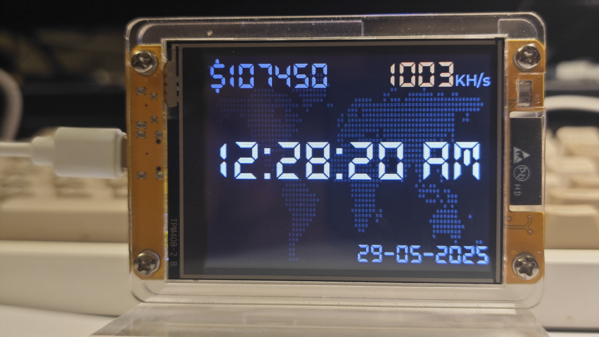
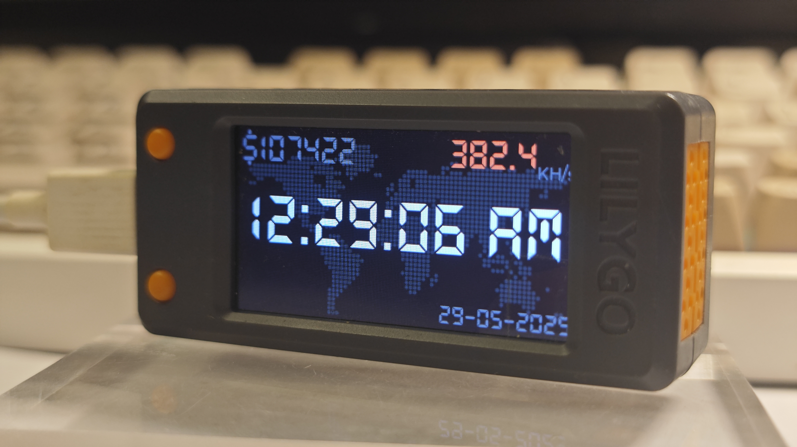
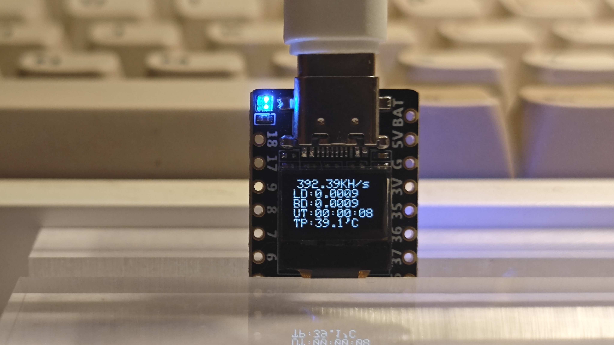
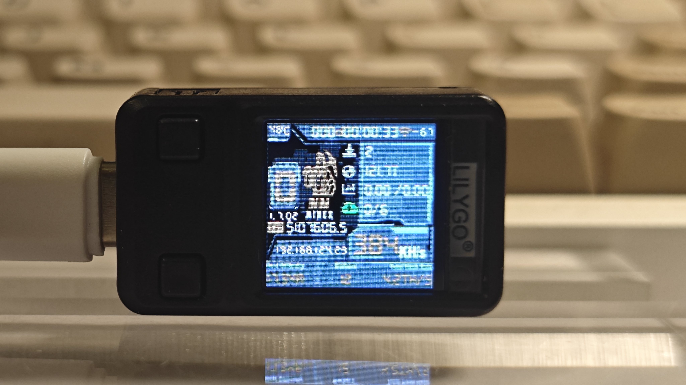

  <h1>Make it better</h1>

## NMMiner
- Easy deployment with one click [NMMiner Flash Tool](https://flash.nmminer.com/).

## Requirements
- Boards with ESP32S3, ESP32D0 , ESP32C3 as so far.

## Features
- Deeply optimization for ESP32D0, max hashrate: 993 KH/s.
- Deeply optimization for ESP32S3, max hashrate: 318 KH/s.
- Deeply optimization for ESP32C3, max hashrate: 308 KH/s.
- NMController_client, [source code](https://github.com/NMminer1024/NMController_client), we put the *_x64.msi and *_x86.msi in tool folder already, just install, only for Windows.
- NMController_web, [source code](https://github.com/NMminer1024/NMController_web), it's a Python implement, for Windows and Mac.

##  Board support from the latest version:
| Boards                                                                                  | Performance                | Chip      |
| :-------------------------------------------------------------------------------------  | :----------------------:|:-----------: |
|ESP32 DEVKitC 32                                                                         | ***993.9KH/s***       | ESP32-D0|
|[Heltec WiFi Lora32 v2](https://heltec.org/project/wifi-lora-32v2/)                      | ***993.5KH/s***       | ESP32-D0|
|[ESP32 2432S028R](https://www.aliexpress.com/item/1005008484663300.html)                 | ***986.3KH/s***       | ESP32-D0|
|ESP32 2432s024                                                                           | ***986.1KH/s***       | ESP32-D0|
|TTGO T Display                                                                           | ***986.2KH/s***       | ESP32-D0|
|ESP32 3248s035                                                                           | ***986.1KH/s***       | ESP32-D0|
|WT32 SC01                                                                                | ***986.1KH/s***       | ESP32-D0|
|ESP32 CAM                                                                                | ***900.1KH/s***       | ESP32-D0|
|[Heltec Wifi Kit32 v3](https://heltec.org/project/wifi-kit32-v3/)                        | ***318.9KH/s***       | ESP32-S3FN8|
|[Heltec WiFi Lora32 v3](https://www.aliexpress.com/item/1005005443005152.html)           | ***317.7KH/s***       | ESP32-S3FN8 |
|[Heltec Wireless Stick Lite v3](https://heltec.org/project/wireless-stick-lite-v2/)      | ***317.3KH/s***       | ESP32-S3FN8 |
|[Heltec Wireless Stick v3](https://heltec.org/project/wireless-stick-v3/)                | ***317.2KH/s***       | ESP32-S3FN8 |
|[NM Bot Chain v1](https://www.aliexpress.com/item/1005008096252566.html)                 | ***313.8KH/s***       | ESP32-S3FN8 |
|Lilygo T Display s3 amoled                                                               | ***310.1KH/s***       | ESP32-S3R8 |
|Lilygo T QT                                                                              | ***308.1KH/s***       | ESP32-S3FN8 |
|[NM USB Chain v1](https://www.aliexpress.com/item/1005008089478881.html)                 | ***309.5KH/s***       | ESP32-S3FN8 |
|[Heltec Vision Master T190](https://www.aliexpress.us/item/1005007449552504.html)        | ***308.4KH/s***       | ESP32-S3R8 |
|Lilygo T Dongle s3                                                                       | ***308.3KH/s***       | ESP32-S3R8 |
|Seeed xiao esp32 s3                                                                      | ***318.7KH/s***       | ESP32-S3FN8 |
|ESP32 s3 0.42 oled                                                                       | ***312.1KH/s***       | ESP32-S3   |
|Seeed xiao esp32 c3                                                                      | ***308.6KH/s***       | ESP32-C3 |
|Lilygo T Display s3                                                                      | ***307.5KH/s***       | ESP32-S3R8 |
|ESP32 s3 geek                                                                            | ***305.1KH/s***       | ESP32-S3   |
|ESP32 c3 0.42 oled                                                                       | ***240.1KH/s***       | ESP32-C3   |

  <table width="100%">
    <tr>
      <td width="50%" align="center"></td>
      <td width="50%" align="center"></td>
    </tr>
  </table>

  <table width="100%">
    <tr>
      <td width="50%" align="center"></td>
      <td width="50%" align="center"></td>
    </tr>
  </table>

  <table width="100%">
    <tr>
      <td width="50%" align="center"></td>
      <td width="50%" align="center"></td>
    </tr>
  </table>

  <table width="100%">
    <tr>
      <td width="50%" align="center"></td>
      <td width="50%" align="center"></td>
    </tr>
  </table>

  <table width="100%">
    <tr>
      <td width="50%" align="center"></td>
      <td width="50%" align="center"></td>
    </tr>
  </table>

  <table width="100%">
    <tr>
      <td width="50%" align="center"></td>
      <td width="50%" align="center"></td>
    </tr>
  </table>

  <table width="100%">
    <tr>
      <td width="50%" align="center"></td>
      <td width="50%" align="center"></td>
    </tr>
  </table>

  <table width="100%">
    <tr>
      <td width="50%" align="center"></td>
      <td width="50%" align="center"></td>
    </tr>
  </table>

  

## Buttons
**Board with only one button**(binding to boot pin)

| Buttons           | Action             | Description             |
| :---------------  | :-----------------:|:-----------------:      |
|boot               | Long press         |  Miner Configuration  |
|boot               | Double click       |  switch to nexe screen page(if a screen on board)        |
|boot               | Single click       |  Screen wake up(if a screen on board)        |

**Board with two buttons**(binding to boot pin and a gpio pin)

| Buttons           | Action             | Description             |
| :---------------  | :-----------------:|:-----------------:      |
|boot               | Long press         |  Clear all status from nvs(if enabled this feature)  |
|boot               | Single click       |  Screen wake up(if a screen on board)         |
|boot               | Double click       |  Screen wake up(if a screen on board)         |
|user               | Single click       |  Screen wake up(if a screen on board)         |
|user               | Double click       |  Switch to next screen(if a screen on board)  |
|user               | Long press         |  Miner Configuration    |

## Screen

  

## Configuration
### Initiation configuration

1. When the device is powered on, it will connect to the last WiFi connected by default. If it fails to connect to this WiFi after trying for 15s, it will automatically enter the configuration mode.

2. Search for AP named: nmap-2.4g, enter password: 12345678

3.  If connect to AP via mobile phone and everything goes well, you will be redirected to the configuration page; if connect to AP via PC, just log in: 192.168.4.1.

  

4. You will see the following page. Follow the steps to configure your mining machine. The larger the UI refresh value, the higher the hash rate, and the hash rate will also increase when the screen is turned off.

  

5. You can return to the configuration page at any time and refer to the [button](#buttons) operations.

6. When you click **Save** it will take a while (10-15 seconds), do not reset the miner manually, just let it restart automatically.

### Force configuration

1. Long press ***boot*** button for one button board.

2. Long press ***user*** button for two buttons board.

3. Then follow [Initiation configuration](#Initiation-configuration).

  

## Firmware update
 **Step 1**: Open [NMMiner Flash Tool](https://flash.nmminer.com/) in Chrome or Edge browser.

 **Step 2**: Choose the board and start the firmware update, **NMMiner Flash Tool** will pull the latest version from github, and configure the flash parameters automatically.
 

  

***Notice1:*** If you just update the latest firmware, that's all you need to do. if you are the first time flash the miner, [firmware activation](#Firmware-activation) is required. 

***Notice2:*** If you lost your licence, just use the [NMMiner Flash Tool](https://flash.nmminer.com/) flash your miner agin, the tool will send you a new one. 

#### Firmware activation 

 **Step 1**: After you flash the firmware, get the licence follow the guide.
 
 

  

 **Step 2**: Copy the the licence string back to licence code box, then click the button, you will see something exciting if everything goes well.
 
 

  

 **Step 3**:  If this is the first time you are flashing the miner, some basic and necessary configurations need to be set, just as below, certainly, you can config them via [Buttons](#Buttons).

 

  

 **Step 4**: Enjoy it!

## Pool
- Due to the very limited on-chip resources, some high-difficulty mining pools currently reject our connections, the following pools support low diff stratum connection.

#### BTC
- stratum+tcp://public-pool.io:21496 , https://web.public-pool.io
- stratum+tcp://pool.tazmining.ch:33333 , https://tazmining.ch/?#
- stratum+tcp://pool.stompi.de:3333 , http://web.stompi.de

## How to monitor

- In fact, both ***NMController_client*** and ***NMController_web*** have the same feature, ***NMController_client*** for Windows, ***NMController_web*** for Windows and MACOS, We make an example by ***NMController_client*** here.

- ***NMController_client***, scan the machine in your LAN, just as below.

  

- configuration via NMControler client, Config single miner or gorup miners.(firmware v1.5.xx required)

  

## Contact
- We are committed to supporting more models of Arduino development boards.
- Anything do not work as your expectation, just let us know.

| Email                   |  Telegram             | Home Page                         |
| :-----------------:     |  :-----------------:  |  :----------------------------:   |
|nmminer1024@gmail.com    |  https://t.me/NMMiner | [NMTech](https://www.nmminer.com/)|

## Release Log

### (2025.04.23) - v1.7.01
- `feature`:
  - None.
- `fix`:
  - WPA group key exchange cause wifi disconnect issue.(This kind of issue is more common on `MikroTik` and `Fritz!box`.)
- `remove`:
  - None.
- `optimize`:
  - ESP32-D0WDQ6-V3 reversion 3 upto 993kH/s.
  - ESP32-D0WDQ6 reversion 1 upto 873kH/s.
  - The initial share difficulty starts from 0.0005

### (2025.04.12) - v1.6.03
- `feature`:
  - New firmware release reminder on miner loading page and miner main page.
  - Pool url field on web monitor page.
  - Pool url display on miner clock page.
- `fix`:
  - When the screen is asleep, tapping the screen will wake it up(for CYD 2.4, 2.8, 3.5).
  - Log issue for pool switch.
- `remove`:
  - Temperature of CYD on web monitor page. 
- `optimize`:
  - ESP32D0 upto 483kH/s.
  - Clock display to 12-hour format.
  - Memory usage.

### (2025.03.30) - v1.6.02
- Add:
  - Screen touch driver to CYD 2.4, 2.8, 3.5 inch board.
- Fixed:
  - CYD ili9341 ui issue.
  - NTP and swarm issue.
- Improved:
  - None.
- Modify:
  - Clock page style.
  - Time zone allow float value input.
  - CYD has no temperature sensor, display real time instead.
  - NTP calibration interval 6h.

### (2025.03.18) - v1.6.01
- Add:
  - board 'esp32 2432s024' support.
  - board 'esp32 3248s035' support.
  - board 'esp32 c3 0.42 oled' support.
  - board 'esp32 s3 0.42 oled' support.
  - board 'esp32 cam' support.
  - board 'wt32 sc01' support.
  - board 'lilygo t qt' support.
- Fixed:
  - Hashrate issues.
- Improved:
  - ESP32 d0 hashrate upto 470kH/s.
  - NMController client update to v0.4.1, *.ini file support.
  - NM-USB-Chain default page to meter page.
  - Add price to clock page.
- Modify:
  - Clock page time rolling to static.

### (2025.03.06) - v1.5.01
- Add:
  - Configure NMMiner via the NMController client to make your life easier.
- Fixed:
  - Restart issue.
- Improved:
  - NMController client update to v0.4.
- Modify:
  - None.

### (2025.03.03) - v1.4.02
- Add:
  - esp32-s3-geek support, upto 308kH/s.
- Fixed:
  - Local diff infinite issues.
- Improved:
  - NMController client update to v0.3.
- Modify:
  - None.

### (2025.02.27) - v1.4.01
- Add:
  - None.
- Fixed:
  - Freezing issues.
- Improved:
  - NMController web server.
- Modify:
  - None.

### (2025.02.26) - v1.3.01
- Add:
  - Led enable/disable option.
- Fixed:
  - Fallback wallet address save failed issue.
- Improved:
  - ESP32d0 upto 412kH/s
- Modify:
  - Get DNS from router.
- Known:
  - Freezing in some wifi environment.

### (2025.02.21) - v1.2.01
- Add:
  - None.
- Fixed:
  - Reboot issue.
  - Freezing issue.
- Improved:
  - ESP32d0 upto 375kH/s
  - ESP32s3 upto 318kH/s
  - ESP32c3 upto 308kH/s.
- Modify:
  - UDP boardcast from 2s to 5s.
  - DNS fixed to 8.8.8.8 and 8.8.4.4

### (2025.02.17) - v1.1.03
- Add:
  - esp32 dev kitc 32 ,upto 340kH/s.
- Fixed:
  - Reboot issue.
  - Freezing issue.
- Improved:
  - ESP32d0 upto 340kH/s, ESP32s3 upto 291kH/s, ESP32c3 upto 284kH/s.
- Modify:
  - None.

### (2025.02.11) - v1.1.02
- Add:
  - None.
- Fixed:
  - Reboot issue.
  - Freezing issue.
- Improved:
  - ESP32 d0 upto 224kH/s.
- Modify:
  - Remove ssl connection.

### (2025.02.08) - v1.1.01
- Add:
  - Fallback pool option.
- Fixed:
  - seeed xiao esp32 c3 configuration mode issue.
- Improved:
  - ESP32 s3 upto 255KH/s,ESP32 c3 upto 240KH/s.
- Modify:
  - SSL option, enable ssl connection in pool URL as "stratum+ssl://example-pool.com:12345"

### (2025.01.31) - v0.6.02
- Add:
  - None.
- Fixed:
  - seeed xiao esp32 c3 configuration mode issue.
- Improved:
  - None.
- Modify:
  - None.

### (2025.01.30) - v0.6.01
- Add:
  - support: seeed xiao esp32 c3 ,seeed xiao esp32 s3
- Fixed:
  - Pool connection time out.
  - Block counter issue.
- Improved:
  - None.
- Modify:
  - None.

### (2025.01.12) - v0.5.03
- Add:
  - support: lilygo-t-display-s3 amoled
- Fixed:
  - None.
- Improved:
  - UDP broadcast protocol format.
- Modify:
  - Configuration mode time out logic.

### (2024.12.19) - v0.5.02
- Add:
  - support: holo-cubic-25mm, upto 117kH/s.
- Fixed:
  - UTC issues.
  - Block counter flase count.
  - QR code issue.
  - Restart constantly.
- Improved:
  - Sahre accept rate.
- Modify:
  - Default Wifi change to 'NMMtech-2.4G'.
  - Default DNS get from LAN.

### (2024.11.22) - v0.5.01
- Add:
  - support: TTGO T display, upto 90~92kH/s.
  - Feature: Led indicator for nm-bot-chain.
  - Feature: Screen brightness adjustment from config page.
- Fixed:
  - UTC issues.
  - Lilygo T Display s3 and TTGO T Display power supply issues.
  - Chip ESP32-D0WDQ6-v1 crashed issues, firmware compatible with ESP32-D0WDQ6-v3.
- Improved:
  - None.
- Modify:
  - User button long pressed to enter miner configuration for 2 buttons boards.
  - Logo 'lottery' to 'miner'.
  - Uptime 999 days maximum.

### (2024.11.14) - v0.4.04
- Add:
  - Board support heltec-wifi-lora32-v2, upto 92kH/s.
- Fixed:
  - Nm-usb-chain gauge calibration.
  - Remove tempurature from CYD board, No tempurature sensor.
- Improved:
  - Breath led on Lilygo T dongle s3.
- Modify:
  - None.
- Baord support
  - [Heltec Vision Master T190](https://www.aliexpress.us/item/1005007449552504.html)
  - [Heltec WiFi Lora32 v2](https://heltec.org/project/wifi-lora-32v2/)
  - [Heltec WiFi Lora32 v3](https://www.aliexpress.com/item/1005005443005152.html)
  - [Heltec Wireless Stick v3](https://heltec.org/project/wireless-stick-v3/)
  - [Heltec Wireless Stick Lite v3](https://heltec.org/project/wireless-stick-lite-v2/)
  - [Heltec Wifi Kit32 v3](https://heltec.org/project/wifi-kit32-v3/)
  - [NM Bot Chain v1](https://www.nmminer.com/product/nm-botchain/)
  - [NM USB Chain v1](https://www.nmminer.com/product/nm-usb-chian/)
  - CYD(ESP32-2432S028R) with ILI9341 and ST7789 TFT driver.
  - Lilygo T Display-s3
  - Lilygo T Dongle-s3

### (2024.11.07) - v0.4.03
- Add:
  - Board support CYD(ESP32-2432S028R) with ILI9341 and ST7789 TFT driver, upto 92kH/s.
- Fixed:
  - Restart issues.
  - Shortage of lvgl heap.
- Improved:
  - None.
- Modify:
  - Remove firmware version in stratum protocol.
  - Update NMControler, Added column sorting.
- Baord support
  - [Heltec Vision Master T190](https://www.aliexpress.us/item/1005007449552504.html)
  - [Heltec WiFi lora 32 v2](https://heltec.org/project/wifi-lora-32v2/)
  - [Heltec WiFi lora 32 v3](https://www.aliexpress.com/item/1005005443005152.html)
  - [Heltec wireless stick v3](https://heltec.org/project/wireless-stick-v3/)
  - [Heltec wireless stick lite v3](https://heltec.org/project/wireless-stick-lite-v2/)
  - [Heltec Wifi kit 32 v3](https://heltec.org/project/wifi-kit32-v3/)
  - [NM-Bot-Chain-V1](https://www.nmminer.com/product/nm-botchain/)
  - NM-USB-Chain-V1(Coming soon to sale)
  - CYD(ESP32-2432S028R) with ILI9341 and ST7789 TFT driver.
  - Lilygo-T-Display-s3
  - Lilygo-T-Dongle-s3

### (2024.10.29) - v0.4.02
- Add:
  - Board support Lilygo T Dongle s3
  - BTC market price(Disable default, enable this feature on config page)
- Fixed:
  - Miner reboot constantly.
- Improved:
  - UI
- Baord support
  - [Heltec Vision Master T190](https://www.aliexpress.us/item/1005007449552504.html)
  - [Heltec WiFi lora 32 v3](https://www.aliexpress.com/item/1005005443005152.html)
  - [Heltec wireless stick v3](https://heltec.org/project/wireless-stick-v3/)
  - [Heltec wireless stick lite v3](https://heltec.org/project/wireless-stick-lite-v2/)
  - [Heltec Wifi kit 32 v3](https://heltec.org/project/wifi-kit32-v3/)
  - Lilygo-T-Display-s3
  - Lilygo-T-Dongle-s3
  - NM-Bot-Chain-V1(Coming soon to sale)
  - NM-USB-Chain-V1(Coming soon to sale)

### (2024.10.21) - v0.4.01
- Add:
  - Board support NM Bot Chain V1
  - Board support NM USB Chain V1
  - Screen orientation option in configuration page.
- Fixed:
  - Valid block worng display, hashrate fall in worng state occasionally.
- Improved:
  - UI
- Baord support
  - [Heltec Vision Master T190](https://www.aliexpress.us/item/1005007449552504.html)
  - [Heltec WiFi lora 32 v3](https://www.aliexpress.com/item/1005005443005152.html)
  - [Heltec wireless stick v3](https://heltec.org/project/wireless-stick-v3/)
  - [Heltec wireless stick lite v3](https://heltec.org/project/wireless-stick-lite-v2/)
  - [Heltec Wifi kit 32 v3](https://heltec.org/project/wifi-kit32-v3/)
  - [All_usbcdc_screenless_esp32s3fn8](https://heltec.org/project/wifi-kit32-v3/)
  - Lilygo-T-Display-s3
  - NM-Bot-Chain-V1(Coming soon to sale)
  - NM-USB-Chain-V1(Coming soon to sale)

### (2024.10.08) - v0.3.04
- Add:
  - Board support Heltec Wireless Stick V3.
- Fixed:
  - None.
- Improved:
  - The initiation order.
- Baord support
  - [Heltec Vision Master T190](https://www.aliexpress.us/item/1005007449552504.html)
  - [Heltec WiFi lora 32 v3](https://www.aliexpress.com/item/1005005443005152.html)
  - [Heltec wireless stick v3](https://heltec.org/project/wireless-stick-v3/)
  - [Heltec wireless stick lite v3](https://heltec.org/project/wireless-stick-lite-v2/)
  - [Heltec Wifi kit 32 v3](https://heltec.org/project/wifi-kit32-v3/)
  - [All_usbcdc_screenless_esp32s3fn8](https://heltec.org/project/wifi-kit32-v3/)
  - Lilygo-T-Display-s3

### (2024.09.27) - v0.3.03
- Add:
  - Board support Lilygo-T-Display s3.
- Fixed:
  - Readme and structure of tool folder.
- Improved:
  - Loading screen.
- Baord support
  - [Heltec Vision Master T190](https://www.aliexpress.us/item/1005007449552504.html)
  - [Heltec WiFi lora 32 v3](https://www.aliexpress.com/item/1005005443005152.html)
  - [Heltec wireless stick lite v3](https://heltec.org/project/wireless-stick-lite-v2/)
  - [Heltec Wifi kit 32 v3](https://heltec.org/project/wifi-kit32-v3/)
  - [All_usbcdc_screenless_esp32s3fn8](https://heltec.org/project/wifi-kit32-v3/)
  - Lilygo-T-Display-s3

### (2024.09.23) - v0.3.02
- Add:
  - Web ESP-Tool.
  - Support chip, esp32fn8.
- Fixed:
  - None
- Improved:
  - None.
- Baord support
  - [Heltec Vision Master T190](https://www.aliexpress.us/item/1005007449552504.html)
  - [Heltec WiFi lora 32 v3](https://www.aliexpress.com/item/1005005443005152.html)
  - [Heltec wireless stick lite v3](https://heltec.org/project/wireless-stick-lite-v2/)
  - [Heltec Wifi kit 32 v3](https://heltec.org/project/wifi-kit32-v3/)
  - [all_usbcdc_screenless_esp32s3fn8](https://heltec.org/project/wifi-kit32-v3/)

### (2024.09.14) - v0.3.02
- Add:
  - License.
- Fixed:
  - None
- Improved:
  - Automatically enter configuration mode.
- Baord support
  - [Heltec Vision Master T190](https://www.aliexpress.us/item/1005007449552504.html)
  - [Heltec WiFi lora 32 v3](https://www.aliexpress.com/item/1005005443005152.html)
  - [Heltec wireless stick lite v3](https://heltec.org/project/wireless-stick-lite-v2/)
  - [Heltec Wifi kit 32 v3](https://heltec.org/project/wifi-kit32-v3/)

### (2024.09.08) - v0.3.01
- Add:
  - None
- Fixed:
  - Readme.md
- Improved:
  - None
- Baord support
  - [Heltec Vision Master T190](https://www.aliexpress.us/item/1005007449552504.html)
  - [Heltec WiFi lora 32 v3](https://www.aliexpress.com/item/1005005443005152.html)

### (2024.09.02) - v0.3.01
- Add:
  - Tool, [***NMController***](https://github.com/NMminer1024/NMController), Something like a LAN centralized monitoring client, Windows 10 or higher require.
  - Firmware, mining status broadcast to LAN. 
- Fixed:
  - None
- Improved:
  - None
- Baord support
  - [Heltec Vision Master T190](https://www.aliexpress.us/item/1005007449552504.html)
  - [Heltec WiFi lora 32 v3](https://www.aliexpress.com/item/1005005443005152.html)

### (2024.09.02) - v0.2.13
- Add:
  - None
- Fixed:
  - License disappear issue when return to configuration page.
- Improved:
  - None
- Baord support
  - [Heltec Vision Master T190](https://www.aliexpress.us/item/1005007449552504.html)
  - [Heltec WiFi lora 32 v3](https://www.aliexpress.com/item/1005005443005152.html)

### (2024.08.31) - v0.2.12
- Add:
  - None
- Fixed:
  - Device would occasionally restart frequently when connecting to WiFi at startup.
- Improved:
  - None
- Baord support
  - [Heltec Vision Master T190](https://www.aliexpress.us/item/1005007449552504.html)
  - [Heltec WiFi lora 32 v3](https://www.aliexpress.com/item/1005005443005152.html)

### (2024.08.27) - v0.2.11
- Add:
  - Web Monitor, makes it easy to monitor your machine without any special client tools. You only need a phone or computer's browser.
  - Heltec WiFi lora 32 v3 firmware
- Fixed:
  - Some issues from WiFi.
- Improved:
  - Memory management.
  - Almost reaching 120KH/s when USB CDC disable.
- Baord support
  - [Heltec Vision Master T190](https://www.aliexpress.us/item/1005007449552504.html)
  - [Heltec WiFi lora 32 v3](https://www.aliexpress.com/item/1005005443005152.html)
- Next
  - Some screenless board support.

### (2024.08.15) - v0.2.10
- Features:
  - BTC solo miner base on esp32s3 series 
  - Up to **118kH/s** 
  - ssl connection support
  - Screen auto off in 60s
  - Real time clock
  - Configuration on websever, it's easy enough to build your first BTC Miner.
  - WiFi signal strength on screen.
- Fixed:
  - Memory leak issues.
  - Stratum nBits sector parse issues.
- Modify:
  - None
- Baord support
  - [Heltec Vision Master T190](https://www.aliexpress.us/item/1005007449552504.html)

### (2024.08.13) - v0.2.02
- Features:
  - BTC solo miner base on esp32s3 series 
  - Up to **118kH/s** 
  - ssl connection support
  - Screen auto off in 60s
  - Real time clock
  - Configuration on websever, it's easy enough to build your first BTC Miner.
  - WiFi signal strength on screen.
- Fixed:
  - Mining status clean issues.
- Modify:
  - None
- Baord support
  - [Heltec Vision Master T190](https://www.aliexpress.us/item/1005007449552504.html)

### (2024.08.10) - v0.2.01
- Features:
  - BTC solo miner base on esp32s3 series 
  - Up to **118kH/s** 
  - ssl connection support
  - Screen auto off in 60s
  - Real time clock
  - Configuration on websever, it's easy enough to build your first BTC Miner.
  - WiFi signal strength on screen.
- Fixed:
  - **Configuration of user BTC address not effective issue.**
- Modify:
  - Contact us, telegram group add.
  - Modify firmware update tools, make it easy to update firmware.
- Baord support
  - [Heltec Vision Master T190](https://www.aliexpress.us/item/1005007449552504.html)

### (2024.08.09) - v0.1.55
- Features:
  - BTC solo miner base on esp32s3 series 
  - Up to **118kH/s** 
  - ssl connection support
  - Screen auto off in 60s
  - Real time clock
  - Configuration on websever, it's easy enough to build your first BTC Miner.
  - WiFi signal strength on screen.
- Fixed:
  - Some ssl issues.
- Modify:
  - Add some log on loading screen.
  - Hashrate upto 118K when screen off.
- Baord support
  - [Heltec Vision Master T190](https://www.aliexpress.us/item/1005007449552504.html)

### (2024.08.02) - v0.1.54
- Features:
  - BTC solo miner base on esp32s3 series 
  - Up to **117kH/s** 
  - ssl connection support
  - Screen auto off in 60s
  - Real time clock
  - Configuration on websever, it's easy enough to build your first BTC Miner.
  - WiFi Signal Strength add.
- Fixed:
  - Some issues after full chip erase.
- Modify:
  - None
- Baord support
  - [Heltec Vision Master T190](https://www.aliexpress.us/item/1005007449552504.html)

### (2024.08.01) - v0.1.53
- Features:
  - BTC solo miner base on esp32s3 series 
  - Up to **117kH/s** 
  - ssl connection support
  - Screen auto off in 60s
  - Real time clock
  - Configuration on websever, it's easy enough to build your first BTC Miner.
  - WiFi Signal Strength add.
- Fixed:
  - Fixed default WiFi parameters issues.
  - Fixed parameter of 'screen off time out'.
- Modify:
  - Some nvs handles, not compatible with v0.1.52.
- Baord support
  - [Heltec Vision Master T190](https://www.aliexpress.us/item/1005007449552504.html)

### (2024.07.31) - v0.1.52
- Features:
  - BTC solo miner base on esp32s3 series 
  - Up to **117kH/s** 
  - ssl connection support
  - Screen auto off in 60s, can be setted from the Configuration Page
  - Real-time clock
  - Configuration on webserver, it's easy enough to build your first BTC Miner.
- Fixed:
  - First push 
- Modify:
  - None
- Board support
  - [Heltec Vision Master T190](https://www.aliexpress.us/item/1005007449552504.html)
