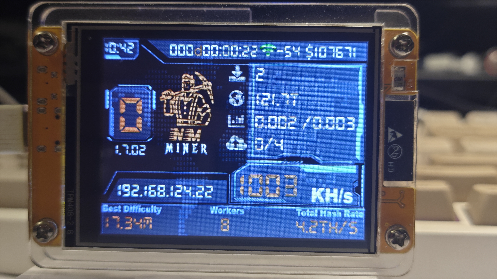
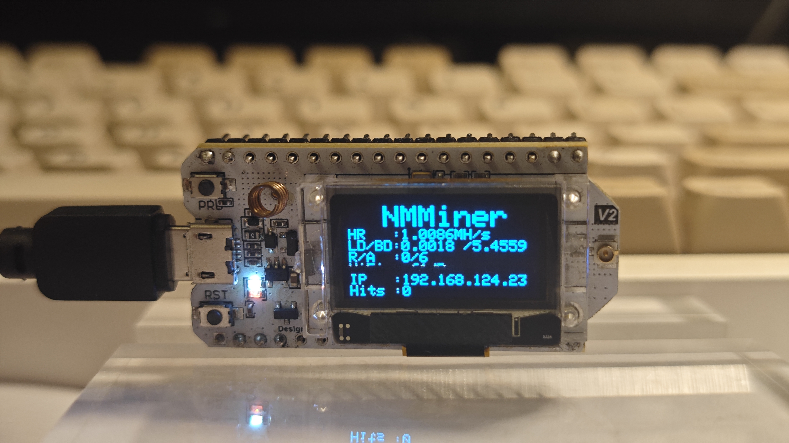
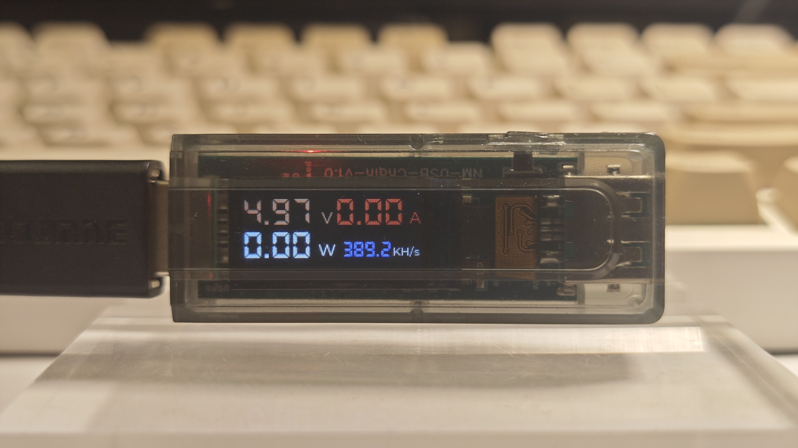
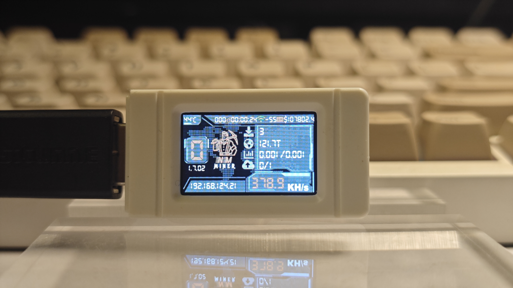
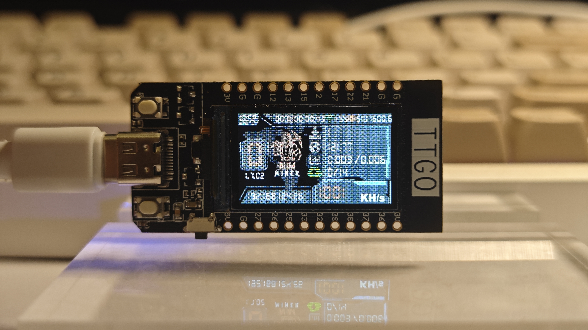
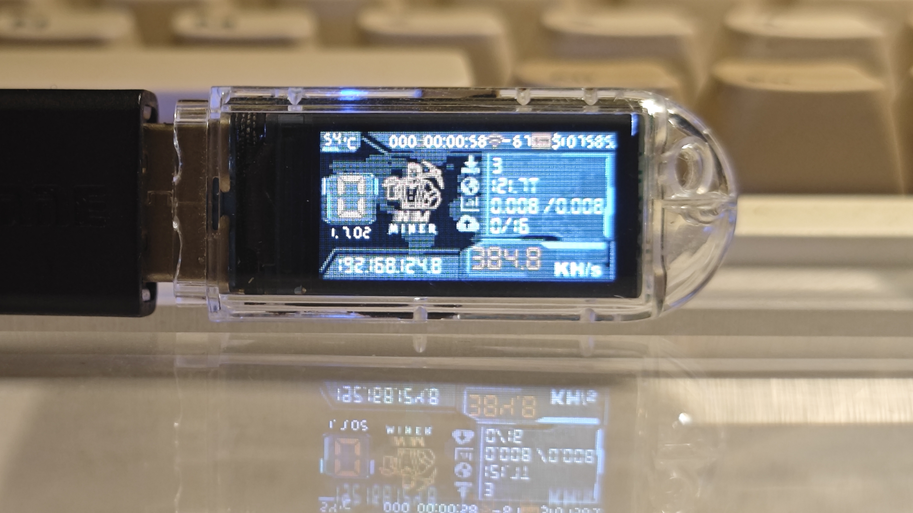
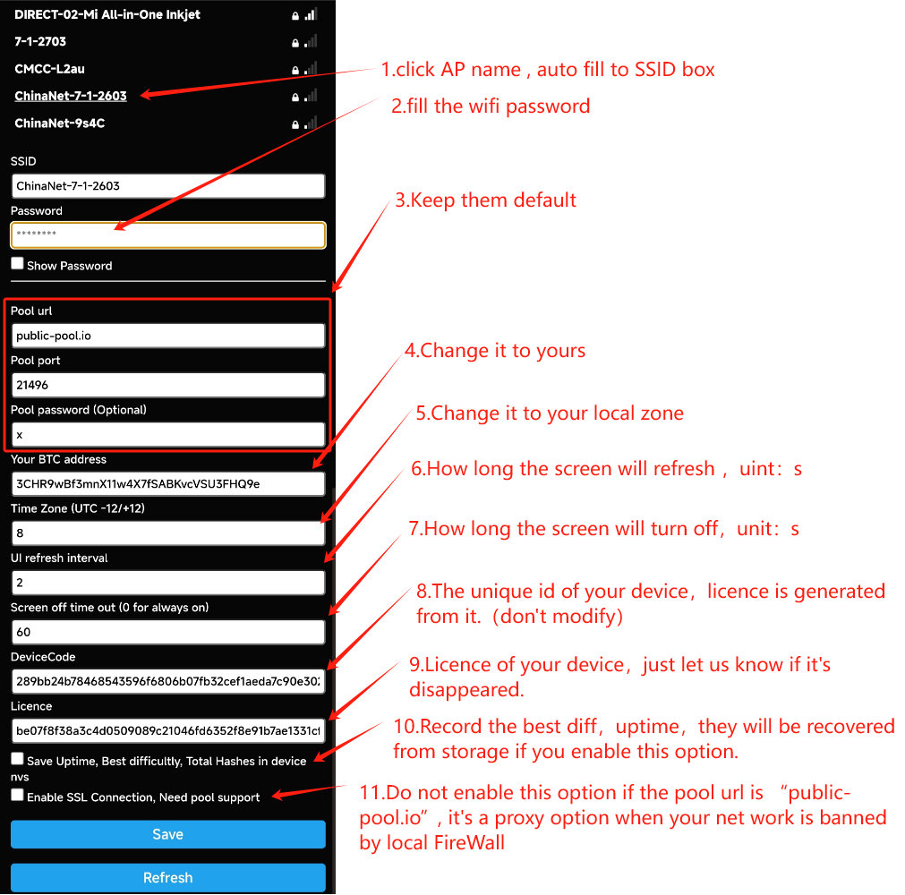

  <h1>NMMiner</h1>
  <h3><em>Make it better</em></h3>

## Overview

NMMiner is an optimized BTC mining firmware designed for ESP32-based development boards. With one-click deployment through the [NMMiner Flash Tool](https://flash.nmminer.com/), it provides an accessible entry point into cryptocurrency mining.

## Requirements

- ESP32 development boards with the following chips:
  - ESP32-S3
  - ESP32-D0
  - ESP32-C3

## Key Features

- **Optimized Performance**
  - ESP32-D0: Up to 1,012 KH/s
  - ESP32-S3: Up to 390 KH/s
  - ESP32-C3: Up to 402 KH/s

- **Management Tools**
  - **NMController Client**: Windows desktop application ([source code](https://github.com/NMminer1024/NMController_client))
    - Pre-compiled installers (x64 and x86) available in the `tool` folder
  - **NMController Web**: Cross-platform Python implementation ([source code](https://github.com/NMminer1024/NMController_web))
    - Compatible with Windows and macOS

---

## Supported Hardware

The following table shows the supported development boards and their performance metrics:

| Board                                                                                   | Performance       | Chip         |
| :------------------------------------------------------------------------------------- | :---------------: | :----------: |
| [NM-TV-154](https://www.nmminer.com/product/nm-tv-154/)                               | **1010.9 KH/s**  | ESP32-D0     |
| ESP32 DEVKitC 32                                                                      | **1009.9 KH/s**  | ESP32-D0     |
| [Heltec WiFi LoRa32 v2](https://heltec.org/project/wifi-lora-32v2/)                  | **1004.5 KH/s**  | ESP32-D0     |
| [ESP32 2432S028R](https://www.aliexpress.com/item/1005008484663300.html)             | **1004.3 KH/s**  | ESP32-D0     |
| ESP32 2432s024                                                                        | **1004.1 KH/s**  | ESP32-D0     |
| TTGO T-Display                                                                        | **1004.2 KH/s**  | ESP32-D0     |
| ESP32 3248s035                                                                        | **1004.1 KH/s**  | ESP32-D0     |
| ESP32 CAM                                                                             | **1004.1 KH/s**  | ESP32-D0     |
| ELECROW esp32 display 2.4inch                                                         | **1004.1 KH/s**  | ESP32-D0     |
| ELECROW esp32 display 2.8inch                                                         | **1004.1 KH/s**  | ESP32-D0     |
| WT32-SC01                                                                             | **857.1 KH/s**   | ESP32-D0     |
| Seeed XIAO ESP32-C3                                                                   | **396.9 KH/s**   | ESP32-C3     |
| [Heltec WiFi Kit32 v3](https://heltec.org/project/wifi-kit32-v3/)                    | **400.9 KH/s**   | ESP32-S3FN8  |
| [Heltec WiFi LoRa32 v3](https://www.aliexpress.com/item/1005005443005152.html)       | **400.7 KH/s**   | ESP32-S3FN8  |
| [Heltec Wireless Stick Lite v3](https://heltec.org/project/wireless-stick-lite-v2/)  | **399.3 KH/s**   | ESP32-S3FN8  |
| [Heltec Wireless Stick v3](https://heltec.org/project/wireless-stick-v3/)            | **398.2 KH/s**   | ESP32-S3FN8  |
| [NM Bot Chain v1](https://www.aliexpress.com/item/1005008096252566.html)             | **393.8 KH/s**   | ESP32-S3FN8  |
| Seeed XIAO ESP32-S3                                                                   | **393.7 KH/s**   | ESP32-S3FN8  |
| ESP32-S3 0.42" OLED                                                                   | **392.1 KH/s**   | ESP32-S3     |
| LilyGO T-Display S3 AMOLED                                                            | **390.1 KH/s**   | ESP32-S3R8   |
| [Heltec Vision Master T190](https://www.aliexpress.us/item/1005007449552504.html)    | **388.4 KH/s**   | ESP32-S3R8   |
| [NM USB Chain v1](https://www.aliexpress.com/item/1005008089478881.html)             | **387.5 KH/s**   | ESP32-S3FN8  |
| LilyGO T-Dongle S3                                                                    | **385.3 KH/s**   | ESP32-S3R8   |
| LilyGO T-Display S3                                                                   | **384.5 KH/s**   | ESP32-S3R8   |
| Waveshare ESP32 S3 LCD 1.47                                                           | **384.5 KH/s**   | ESP32-S3R8   |
| Waveshare ESP32 S3 LCD 1.47B                                                          | **383.5 KH/s**   | ESP32-S3R8   |
| Waveshare ESP32 S3 Touch LCD 35                                                       | **380.3 KH/s**   | ESP32-S3R8   |
| ESP32-S3 Geek                                                                         | **378.1 KH/s**   | ESP32-S3     |
| LilyGO T-QT                                                                           | **361.1 KH/s**   | ESP32-S3FN8  |
| ESP32-C3 0.42" OLED                                                                   | **315.1 KH/s**   | ESP32-C3     |

---

## Hardware Showcase

  <table width="100%">
    <tr>
      <td width="50%" align="center"></td>
      <td width="50%" align="center"></td>
    </tr>
  </table>

  <table width="100%">
    <tr>
      <td width="50%" align="center"></td>
      <td width="50%" align="center"></td>
    </tr>
  </table>

  <table width="100%">
    <tr>
      <td width="50%" align="center"></td>
      <td width="50%" align="center"></td>
    </tr>
  </table>

  <table width="100%">
    <tr>
      <td width="50%" align="center"></td>
      <td width="50%" align="center"></td>
    </tr>
  </table>

  <table width="100%">
    <tr>
      <td width="50%" align="center"></td>
      <td width="50%" align="center"></td>
    </tr>
  </table>

  <table width="100%">
    <tr>
      <td width="50%" align="center"></td>
      <td width="50%" align="center"></td>
    </tr>
  </table>

  <table width="100%">
    <tr>
      <td width="50%" align="center"></td>
      <td width="50%" align="center"></td>
    </tr>
  </table>

  <table width="100%">
    <tr>
      <td width="50%" align="center"></td>
      <td width="50%" align="center"></td>
    </tr>
  </table>

  <table width="100%">
    <tr>
      <td width="50%" align="center"></td>
      <td width="50%" align="center"></td>
    </tr>
  </table>

  <table width="100%">
    <tr>
      <td width="50%" align="center"></td>
      <td width="50%" align="center"></td>
    </tr>
  </table>

  

---

### Button Controls

#### Single Button Boards
Boards equipped with only a boot button:

| Button | Action        | Function                                           |
| :----- | :------------ | :------------------------------------------------- |
| Boot   | Long press    | Enter miner configuration mode                     |
| Boot   | Double click  | Switch to next screen page (if display available) |
| Boot   | Single click  | Wake up screen (if display available)             |

#### Dual Button Boards
Boards with both boot and user buttons:

| Button | Action        | Function                                           |
| :----- | :------------ | :------------------------------------------------- |
| Boot   | Long press    | Clear all status from NVS (if feature enabled)    |
| Boot   | Single click  | Wake up screen (if display available)             |
| Boot   | Double click  | Wake up screen (if display available)             |
| User   | Single click  | Wake up screen (if display available)             |
| User   | Double click  | Switch to next screen (if display available)      |
| User   | Long press    | Enter miner configuration mode                     |

### Display Information

  

---

## Initial Setup

### First-Time Configuration

1. **Automatic WiFi Connection**: Upon power-on, the device attempts to connect to the previously configured WiFi network. If connection fails after 15 seconds, it automatically enters configuration mode.

2. **Access Point Setup**: Search for the free access point named `nmap-2.4g` (no password required).

3. **Configuration Interface**: 
   - **Mobile devices**: You will be automatically redirected to the configuration page
   - **PC/Desktop**: Navigate to `192.168.4.1` in your web browser

  

4. **Parameter Configuration**: Configure your mining parameters following the on-screen instructions. Note that higher UI refresh values result in increased hash rates, and hash rates also improve when the display is turned off.

  

5. **Accessing Configuration**: You can return to the configuration page at any time using the [button controls](#button-controls).

6. **Saving Settings**: After clicking **Save**, allow 10-15 seconds for the process to complete. Do not manually reset the device; it will restart automatically.

### Manual Configuration Mode

For single button boards:
1. Long press the **boot** button

For dual button boards:
1. Long press the **user** button

2. Follow the [First-Time Configuration](#first-time-configuration) steps.

  

---

## Firmware Installation & Updates

### Using NMMiner Flash Tool

**Step 1**: Open the [NMMiner Flash Tool](https://flash.nmminer.com/) in Chrome or Edge browser.

**Step 2**: Select your board model and initiate the firmware update. The tool will automatically:
- Download the latest firmware version from GitHub
- Configure flash parameters for your specific board

  

> **Note 1**: If you're simply updating existing firmware, the above steps are sufficient. For first-time installations, [firmware activation](#firmware-activation) is required.

> **Note 2**: If you lose your license, re-flash your device using the [NMMiner Flash Tool](https://flash.nmminer.com/) to receive a new license automatically.

### Firmware Activation

**Step 1**: After flashing the firmware, obtain your license following the on-screen instructions.

  

**Step 2**: Copy the license string into the license code field and click the activation button. Successful activation will display a confirmation message.

  

**Step 3**: For first-time installations, configure basic settings as shown below. Alternatively, you can configure these settings later using the [button controls](#button-controls).

  

**Step 4**: Your miner is now ready to use!

### Mining Pool Configuration

Due to limited on-chip resources, some high-difficulty mining pools may reject connections from ESP32-based miners. The following pools support low-difficulty stratum connections suitable for this hardware:

#### Bitcoin (BTC)
- `stratum+tcp://public-pool.io:21496` - [Home page](https://web.public-pool.io)
- `stratum+tcp://pool.tazmining.ch:33333` - [Home page](https://tazmining.ch/?#)

#### DigiByte (DGB)
- `stratum+tcp://dgb-stratum.solominer.net:3333` - [Home page](https://digibyte.solominer.net/#/)

---

## Monitoring & Management

#### NMController Applications

Both **NMController Client** and **NMController Web** provide identical functionality:
- **NMController Client**: Windows desktop application
- **NMController Web**: Cross-platform solution for Windows and macOS

#### Network Scanning with NMController Client

The client automatically scans your local network to discover active miners:

  

#### Device Configuration

Configure individual miners or groups of miners through the NMController interface (requires firmware v1.5.xx or later):

  

#### Web-Based Monitoring

Access the web monitoring interface by navigating to your miner's IP address in a web browser. This interface provides functionality similar to NMController:

  

---

## Support & Contact

We are committed to expanding support for additional Arduino development board models. If you encounter any issues or have suggestions for improvement, please reach out to us.

| Contact Method | Details                                                    |
| :------------: | :--------------------------------------------------------- |
| **Email**      | nmminer1024@gmail.com                                      |
| **Telegram**   | [https://t.me/NMMiner](https://t.me/NMMiner)               |
| **Website**    | [NMTech Official Site](https://www.nmminer.com/)          |

---

## Release Log

### (2025.11.25) - v1.8.23
- `board support`:
  - `elecrow_esp32_display_24inch` and `elecrow_esp32_display_28inch`.
- `feature`:
  - New clock style(remove second)
  - Merry Christmas surprise(Trigger on Christmas Day, exit via any screen touch), board support NMTV-154, CYD2.4 , CYD2.8 ,CYD3.5
- `fix`:
  - Block hit counter issue.
- `remove`:
  - None.
- `optimize`:
  - Stability Optimization.

### (2025.11.04) - v1.8.22
- `board support`:
  - None.
- `feature`:
  - Date format adjustable by users in clock page.
  - 24h and 12h time format adjustableby users in clock page.
- `fix`:
  - Some potential restart risks.
  - Screen dead pixels on the loading page of miner.
- `remove`:
  - None.
- `optimize`:
  - Stability Optimization.
  - Some known issues.

### (2025.10.06) - v1.8.20
- `board support`:
  - `waveshare-esp32-s3-touch-lcd-35`
- `feature`:
  - Resumes on the last page after a shutdown or crash.
- `fix`:
  - Some potential restart risks.
- `remove`:
  - None.
- `optimize`:
  - Coin price page alignment optimization.
  - Screen lights up gradually when you turn on the miner to avoid screen distortion.

### (2025.08.14) - v1.8.10
- `board support`:
  - A new screen driver for `esp32-c3-042-oled`
- `feature`:
  - Multi-currency price page on miner screen.
- `fix`:
  - Oled device display.
  - License lost issue on `waveshare-esp32-s3-lcd-147` and `waveshare-esp32-s3-lcd-147b` board.
- `remove`:
  - Market price enable option on config page.
- `optimize`:
  - Memory usage.

### (2025.07.29) - v1.7.06
- `board support`:
  - None.
- `feature`:
  - A totally new web monitor page for each miner(monitor and config all other miners on this kind of page).
- `fix`:
  - Primary pool lost and recover logic.
- `remove`:
  - None.
- `optimize`:
  - Memory usage.
  - ssl connection.
  - Price color on clock page, green for raise and red for drop. 

### (2025.07.18) - v1.7.05
- `board support`:
  - `Waveshare-esp32-s3-lcd-147(USB-A)` and `Waveshare-esp32-s3-lcd-147b(USB-C)`.
- `feature`:
  - When the primary mining pool active again, miner will switch back to the primary pool within 10s.
- `fix`:
  - Hit value issue on NM-TV clock page.
  - Screen can not wakeup in sleep mode on NM-TV .
- `remove`:
  - None.
- `optimize`:
  - Miner page UI for share : `session best/all time best` when enable "save status" option.
  - Miner page UI for share : `session last/session best`  when disable "save status" option.
   
### (2025.07.11) - v1.7.04
- `feature`:
  - None.
- `fix`:
  - Loading page stuck issue.
- `remove`:
  - None.
- `optimize`:
  - Clock page.
  - Memory usage.

### (2025.06.16) - v1.7.03
- `feature`:
  - None.
- `fix`:
  - Wifi connection issues.
  - Market Price freeze issues.
- `remove`:
  - Last diff in miner page.
- `optimize`:
  - UI of clock page on T-display s3 dongle.

### (2025.05.28) - v1.7.02
- `feature`:
  - Add NM-TV-154 board support, upto 1010kH/s.
  - Auto timezone.
  - Dark style of clock page.
- `fix`:
  - Some wifi connection issues.
  - Price display overflow issue.
- `remove`:
  - Share status save in nvs(only save best diff and block hit conuter).
  - Timezone in configuration page.
- `optimize`:
  - ESP32-D0WDQ6-V3 reversion 3 upto 1010kH/s.
  - ESP32-D0WDQ6 reversion 1 upto 857kH/s.
  - ESP32-S3 upto 390kH/s.
  - ESP32-C3 upto 396kH/s.
  - Random delay when connecting to Wi-Fi to avoid being denied access by the router.

### (2025.04.23) - v1.7.01
- `feature`:
  - None.
- `fix`:
  - WPA group key exchange cause wifi disconnect issue.(This kind of issue is more common on `MikroTik` and `Fritz!box`.)
- `remove`:
  - None.
- `optimize`:
  - ESP32-D0WDQ6-V3 reversion 3 upto 993kH/s.
  - ESP32-D0WDQ6 reversion 1 upto 873kH/s.
  - The initial share difficulty starts from 0.0005

### (2025.04.12) - v1.6.03
- `feature`:
  - New firmware release reminder on miner loading page and miner main page.
  - Pool url field on web monitor page.
  - Pool url display on miner clock page.
- `fix`:
  - When the screen is asleep, tapping the screen will wake it up(for CYD 2.4, 2.8, 3.5).
  - Log issue for pool switch.
- `remove`:
  - Temperature of CYD on web monitor page. 
- `optimize`:
  - ESP32D0 upto 483kH/s.
  - Clock display to 12-hour format.
  - Memory usage.

### (2025.03.30) - v1.6.02
- Add:
  - Screen touch driver to CYD 2.4, 2.8, 3.5 inch board.
- Fixed:
  - CYD ili9341 ui issue.
  - NTP and swarm issue.
- Improved:
  - None.
- Modify:
  - Clock page style.
  - Time zone allow float value input.
  - CYD has no temperature sensor, display real time instead.
  - NTP calibration interval 6h.

### (2025.03.18) - v1.6.01
- Add:
  - board 'esp32 2432s024' support.
  - board 'esp32 3248s035' support.
  - board 'esp32 c3 0.42 oled' support.
  - board 'esp32 s3 0.42 oled' support.
  - board 'esp32 cam' support.
  - board 'wt32 sc01' support.
  - board 'lilygo t qt' support.
- Fixed:
  - Hashrate issues.
- Improved:
  - ESP32 d0 hashrate upto 470kH/s.
  - NMController client update to v0.4.1, *.ini file support.
  - NM-USB-Chain default page to meter page.
  - Add price to clock page.
- Modify:
  - Clock page time rolling to static.

### (2025.03.06) - v1.5.01
- Add:
  - Configure NMMiner via the NMController client to make your life easier.
- Fixed:
  - Restart issue.
- Improved:
  - NMController client update to v0.4.
- Modify:
  - None.

### (2025.03.03) - v1.4.02
- Add:
  - esp32-s3-geek support, upto 308kH/s.
- Fixed:
  - Local diff infinite issues.
- Improved:
  - NMController client update to v0.3.
- Modify:
  - None.

### (2025.02.27) - v1.4.01
- Add:
  - None.
- Fixed:
  - Freezing issues.
- Improved:
  - NMController web server.
- Modify:
  - None.

### (2025.02.26) - v1.3.01
- Add:
  - Led enable/disable option.
- Fixed:
  - Fallback wallet address save failed issue.
- Improved:
  - ESP32d0 upto 412kH/s
- Modify:
  - Get DNS from router.
- Known:
  - Freezing in some wifi environment.

### (2025.02.21) - v1.2.01
- Add:
  - None.
- Fixed:
  - Reboot issue.
  - Freezing issue.
- Improved:
  - ESP32d0 upto 375kH/s
  - ESP32s3 upto 318kH/s
  - ESP32c3 upto 308kH/s.
- Modify:
  - UDP boardcast from 2s to 5s.
  - DNS fixed to 8.8.8.8 and 8.8.4.4

### (2025.02.17) - v1.1.03
- Add:
  - esp32 dev kitc 32 ,upto 340kH/s.
- Fixed:
  - Reboot issue.
  - Freezing issue.
- Improved:
  - ESP32d0 upto 340kH/s, ESP32s3 upto 291kH/s, ESP32c3 upto 284kH/s.
- Modify:
  - None.

### (2025.02.11) - v1.1.02
- Add:
  - None.
- Fixed:
  - Reboot issue.
  - Freezing issue.
- Improved:
  - ESP32 d0 upto 224kH/s.
- Modify:
  - Remove ssl connection.

### (2025.02.08) - v1.1.01
- Add:
  - Fallback pool option.
- Fixed:
  - seeed xiao esp32 c3 configuration mode issue.
- Improved:
  - ESP32 s3 upto 255KH/s,ESP32 c3 upto 240KH/s.
- Modify:
  - SSL option, enable ssl connection in pool URL as "stratum+ssl://example-pool.com:12345"

### (2025.01.31) - v0.6.02
- Add:
  - None.
- Fixed:
  - seeed xiao esp32 c3 configuration mode issue.
- Improved:
  - None.
- Modify:
  - None.

### (2025.01.30) - v0.6.01
- Add:
  - support: seeed xiao esp32 c3 ,seeed xiao esp32 s3
- Fixed:
  - Pool connection time out.
  - Block counter issue.
- Improved:
  - None.
- Modify:
  - None.

### (2025.01.12) - v0.5.03
- Add:
  - support: lilygo-t-display-s3 amoled
- Fixed:
  - None.
- Improved:
  - UDP broadcast protocol format.
- Modify:
  - Configuration mode time out logic.

### (2024.12.19) - v0.5.02
- Add:
  - support: holo-cubic-25mm, upto 117kH/s.
- Fixed:
  - UTC issues.
  - Block counter flase count.
  - QR code issue.
  - Restart constantly.
- Improved:
  - Sahre accept rate.
- Modify:
  - Default Wifi change to 'NMMtech-2.4G'.
  - Default DNS get from LAN.

### (2024.11.22) - v0.5.01
- Add:
  - support: TTGO T display, upto 90~92kH/s.
  - Feature: Led indicator for nm-bot-chain.
  - Feature: Screen brightness adjustment from config page.
- Fixed:
  - UTC issues.
  - Lilygo T Display s3 and TTGO T Display power supply issues.
  - Chip ESP32-D0WDQ6-v1 crashed issues, firmware compatible with ESP32-D0WDQ6-v3.
- Improved:
  - None.
- Modify:
  - User button long pressed to enter miner configuration for 2 buttons boards.
  - Logo 'lottery' to 'miner'.
  - Uptime 999 days maximum.

### (2024.11.14) - v0.4.04
- Add:
  - Board support heltec-wifi-lora32-v2, upto 92kH/s.
- Fixed:
  - Nm-usb-chain gauge calibration.
  - Remove tempurature from CYD board, No tempurature sensor.
- Improved:
  - Breath led on Lilygo T dongle s3.
- Modify:
  - None.
- Baord support
  - [Heltec Vision Master T190](https://www.aliexpress.us/item/1005007449552504.html)
  - [Heltec WiFi Lora32 v2](https://heltec.org/project/wifi-lora-32v2/)
  - [Heltec WiFi Lora32 v3](https://www.aliexpress.com/item/1005005443005152.html)
  - [Heltec Wireless Stick v3](https://heltec.org/project/wireless-stick-v3/)
  - [Heltec Wireless Stick Lite v3](https://heltec.org/project/wireless-stick-lite-v2/)
  - [Heltec Wifi Kit32 v3](https://heltec.org/project/wifi-kit32-v3/)
  - [NM Bot Chain v1](https://www.nmminer.com/product/nm-botchain/)
  - [NM USB Chain v1](https://www.nmminer.com/product/nm-usb-chian/)
  - CYD(ESP32-2432S028R) with ILI9341 and ST7789 TFT driver.
  - Lilygo T Display-s3
  - Lilygo T Dongle-s3

### (2024.11.07) - v0.4.03
- Add:
  - Board support CYD(ESP32-2432S028R) with ILI9341 and ST7789 TFT driver, upto 92kH/s.
- Fixed:
  - Restart issues.
  - Shortage of lvgl heap.
- Improved:
  - None.
- Modify:
  - Remove firmware version in stratum protocol.
  - Update NMControler, Added column sorting.
- Baord support
  - [Heltec Vision Master T190](https://www.aliexpress.us/item/1005007449552504.html)
  - [Heltec WiFi lora 32 v2](https://heltec.org/project/wifi-lora-32v2/)
  - [Heltec WiFi lora 32 v3](https://www.aliexpress.com/item/1005005443005152.html)
  - [Heltec wireless stick v3](https://heltec.org/project/wireless-stick-v3/)
  - [Heltec wireless stick lite v3](https://heltec.org/project/wireless-stick-lite-v2/)
  - [Heltec Wifi kit 32 v3](https://heltec.org/project/wifi-kit32-v3/)
  - [NM-Bot-Chain-V1](https://www.nmminer.com/product/nm-botchain/)
  - NM-USB-Chain-V1(Coming soon to sale)
  - CYD(ESP32-2432S028R) with ILI9341 and ST7789 TFT driver.
  - Lilygo-T-Display-s3
  - Lilygo-T-Dongle-s3

### (2024.10.29) - v0.4.02
- Add:
  - Board support Lilygo T Dongle s3
  - BTC market price(Disable default, enable this feature on config page)
- Fixed:
  - Miner reboot constantly.
- Improved:
  - UI
- Baord support
  - [Heltec Vision Master T190](https://www.aliexpress.us/item/1005007449552504.html)
  - [Heltec WiFi lora 32 v3](https://www.aliexpress.com/item/1005005443005152.html)
  - [Heltec wireless stick v3](https://heltec.org/project/wireless-stick-v3/)
  - [Heltec wireless stick lite v3](https://heltec.org/project/wireless-stick-lite-v2/)
  - [Heltec Wifi kit 32 v3](https://heltec.org/project/wifi-kit32-v3/)
  - Lilygo-T-Display-s3
  - Lilygo-T-Dongle-s3
  - NM-Bot-Chain-V1(Coming soon to sale)
  - NM-USB-Chain-V1(Coming soon to sale)

### (2024.10.21) - v0.4.01
- Add:
  - Board support NM Bot Chain V1
  - Board support NM USB Chain V1
  - Screen orientation option in configuration page.
- Fixed:
  - Valid block worng display, hashrate fall in worng state occasionally.
- Improved:
  - UI
- Baord support
  - [Heltec Vision Master T190](https://www.aliexpress.us/item/1005007449552504.html)
  - [Heltec WiFi lora 32 v3](https://www.aliexpress.com/item/1005005443005152.html)
  - [Heltec wireless stick v3](https://heltec.org/project/wireless-stick-v3/)
  - [Heltec wireless stick lite v3](https://heltec.org/project/wireless-stick-lite-v2/)
  - [Heltec Wifi kit 32 v3](https://heltec.org/project/wifi-kit32-v3/)
  - [All_usbcdc_screenless_esp32s3fn8](https://heltec.org/project/wifi-kit32-v3/)
  - Lilygo-T-Display-s3
  - NM-Bot-Chain-V1(Coming soon to sale)
  - NM-USB-Chain-V1(Coming soon to sale)

### (2024.10.08) - v0.3.04
- Add:
  - Board support Heltec Wireless Stick V3.
- Fixed:
  - None.
- Improved:
  - The initiation order.
- Baord support
  - [Heltec Vision Master T190](https://www.aliexpress.us/item/1005007449552504.html)
  - [Heltec WiFi lora 32 v3](https://www.aliexpress.com/item/1005005443005152.html)
  - [Heltec wireless stick v3](https://heltec.org/project/wireless-stick-v3/)
  - [Heltec wireless stick lite v3](https://heltec.org/project/wireless-stick-lite-v2/)
  - [Heltec Wifi kit 32 v3](https://heltec.org/project/wifi-kit32-v3/)
  - [All_usbcdc_screenless_esp32s3fn8](https://heltec.org/project/wifi-kit32-v3/)
  - Lilygo-T-Display-s3

### (2024.09.27) - v0.3.03
- Add:
  - Board support Lilygo-T-Display s3.
- Fixed:
  - Readme and structure of tool folder.
- Improved:
  - Loading screen.
- Baord support
  - [Heltec Vision Master T190](https://www.aliexpress.us/item/1005007449552504.html)
  - [Heltec WiFi lora 32 v3](https://www.aliexpress.com/item/1005005443005152.html)
  - [Heltec wireless stick lite v3](https://heltec.org/project/wireless-stick-lite-v2/)
  - [Heltec Wifi kit 32 v3](https://heltec.org/project/wifi-kit32-v3/)
  - [All_usbcdc_screenless_esp32s3fn8](https://heltec.org/project/wifi-kit32-v3/)
  - Lilygo-T-Display-s3

### (2024.09.23) - v0.3.02
- Add:
  - Web ESP-Tool.
  - Support chip, esp32fn8.
- Fixed:
  - None
- Improved:
  - None.
- Baord support
  - [Heltec Vision Master T190](https://www.aliexpress.us/item/1005007449552504.html)
  - [Heltec WiFi lora 32 v3](https://www.aliexpress.com/item/1005005443005152.html)
  - [Heltec wireless stick lite v3](https://heltec.org/project/wireless-stick-lite-v2/)
  - [Heltec Wifi kit 32 v3](https://heltec.org/project/wifi-kit32-v3/)
  - [all_usbcdc_screenless_esp32s3fn8](https://heltec.org/project/wifi-kit32-v3/)

### (2024.09.14) - v0.3.02
- Add:
  - License.
- Fixed:
  - None
- Improved:
  - Automatically enter configuration mode.
- Baord support
  - [Heltec Vision Master T190](https://www.aliexpress.us/item/1005007449552504.html)
  - [Heltec WiFi lora 32 v3](https://www.aliexpress.com/item/1005005443005152.html)
  - [Heltec wireless stick lite v3](https://heltec.org/project/wireless-stick-lite-v2/)
  - [Heltec Wifi kit 32 v3](https://heltec.org/project/wifi-kit32-v3/)

### (2024.09.08) - v0.3.01
- Add:
  - None
- Fixed:
  - Readme.md
- Improved:
  - None
- Baord support
  - [Heltec Vision Master T190](https://www.aliexpress.us/item/1005007449552504.html)
  - [Heltec WiFi lora 32 v3](https://www.aliexpress.com/item/1005005443005152.html)

### (2024.09.02) - v0.3.01
- Add:
  - Tool, [***NMController***](https://github.com/NMminer1024/NMController), Something like a LAN centralized monitoring client, Windows 10 or higher require.
  - Firmware, mining status broadcast to LAN. 
- Fixed:
  - None
- Improved:
  - None
- Baord support
  - [Heltec Vision Master T190](https://www.aliexpress.us/item/1005007449552504.html)
  - [Heltec WiFi lora 32 v3](https://www.aliexpress.com/item/1005005443005152.html)

### (2024.09.02) - v0.2.13
- Add:
  - None
- Fixed:
  - License disappear issue when return to configuration page.
- Improved:
  - None
- Baord support
  - [Heltec Vision Master T190](https://www.aliexpress.us/item/1005007449552504.html)
  - [Heltec WiFi lora 32 v3](https://www.aliexpress.com/item/1005005443005152.html)

### (2024.08.31) - v0.2.12
- Add:
  - None
- Fixed:
  - Device would occasionally restart frequently when connecting to WiFi at startup.
- Improved:
  - None
- Baord support
  - [Heltec Vision Master T190](https://www.aliexpress.us/item/1005007449552504.html)
  - [Heltec WiFi lora 32 v3](https://www.aliexpress.com/item/1005005443005152.html)

### (2024.08.27) - v0.2.11
- Add:
  - Web Monitor, makes it easy to monitor your machine without any special client tools. You only need a phone or computer's browser.
  - Heltec WiFi lora 32 v3 firmware
- Fixed:
  - Some issues from WiFi.
- Improved:
  - Memory management.
  - Almost reaching 120KH/s when USB CDC disable.
- Baord support
  - [Heltec Vision Master T190](https://www.aliexpress.us/item/1005007449552504.html)
  - [Heltec WiFi lora 32 v3](https://www.aliexpress.com/item/1005005443005152.html)
- Next
  - Some screenless board support.

### (2024.08.15) - v0.2.10
- Features:
  - BTC solo miner base on esp32s3 series 
  - Up to **118kH/s** 
  - ssl connection support
  - Screen auto off in 60s
  - Real time clock
  - Configuration on websever, it's easy enough to build your first BTC Miner.
  - WiFi signal strength on screen.
- Fixed:
  - Memory leak issues.
  - Stratum nBits sector parse issues.
- Modify:
  - None
- Baord support
  - [Heltec Vision Master T190](https://www.aliexpress.us/item/1005007449552504.html)

### (2024.08.13) - v0.2.02
- Features:
  - BTC solo miner base on esp32s3 series 
  - Up to **118kH/s** 
  - ssl connection support
  - Screen auto off in 60s
  - Real time clock
  - Configuration on websever, it's easy enough to build your first BTC Miner.
  - WiFi signal strength on screen.
- Fixed:
  - Mining status clean issues.
- Modify:
  - None
- Baord support
  - [Heltec Vision Master T190](https://www.aliexpress.us/item/1005007449552504.html)

### (2024.08.10) - v0.2.01
- Features:
  - BTC solo miner base on esp32s3 series 
  - Up to **118kH/s** 
  - ssl connection support
  - Screen auto off in 60s
  - Real time clock
  - Configuration on websever, it's easy enough to build your first BTC Miner.
  - WiFi signal strength on screen.
- Fixed:
  - **Configuration of user BTC address not effective issue.**
- Modify:
  - Contact us, telegram group add.
  - Modify firmware update tools, make it easy to update firmware.
- Baord support
  - [Heltec Vision Master T190](https://www.aliexpress.us/item/1005007449552504.html)

### (2024.08.09) - v0.1.55
- Features:
  - BTC solo miner base on esp32s3 series 
  - Up to **118kH/s** 
  - ssl connection support
  - Screen auto off in 60s
  - Real time clock
  - Configuration on websever, it's easy enough to build your first BTC Miner.
  - WiFi signal strength on screen.
- Fixed:
  - Some ssl issues.
- Modify:
  - Add some log on loading screen.
  - Hashrate upto 118K when screen off.
- Baord support
  - [Heltec Vision Master T190](https://www.aliexpress.us/item/1005007449552504.html)

### (2024.08.02) - v0.1.54
- Features:
  - BTC solo miner base on esp32s3 series 
  - Up to **117kH/s** 
  - ssl connection support
  - Screen auto off in 60s
  - Real time clock
  - Configuration on websever, it's easy enough to build your first BTC Miner.
  - WiFi Signal Strength add.
- Fixed:
  - Some issues after full chip erase.
- Modify:
  - None
- Baord support
  - [Heltec Vision Master T190](https://www.aliexpress.us/item/1005007449552504.html)

### (2024.08.01) - v0.1.53
- Features:
  - BTC solo miner base on esp32s3 series 
  - Up to **117kH/s** 
  - ssl connection support
  - Screen auto off in 60s
  - Real time clock
  - Configuration on websever, it's easy enough to build your first BTC Miner.
  - WiFi Signal Strength add.
- Fixed:
  - Fixed default WiFi parameters issues.
  - Fixed parameter of 'screen off time out'.
- Modify:
  - Some nvs handles, not compatible with v0.1.52.
- Baord support
  - [Heltec Vision Master T190](https://www.aliexpress.us/item/1005007449552504.html)

### (2024.07.31) - v0.1.52
- Features:
  - BTC solo miner base on esp32s3 series 
  - Up to **117kH/s** 
  - ssl connection support
  - Screen auto off in 60s, can be setted from the Configuration Page
  - Real-time clock
  - Configuration on webserver, it's easy enough to build your first BTC Miner.
- Fixed:
  - First push 
- Modify:
  - None
- Board support
  - [Heltec Vision Master T190](https://www.aliexpress.us/item/1005007449552504.html)
