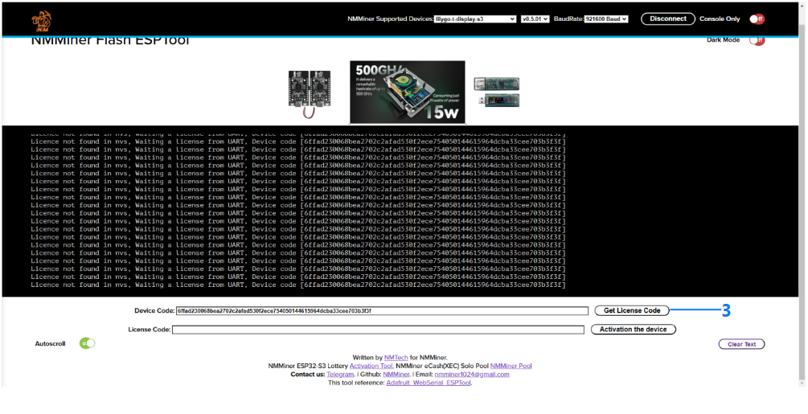
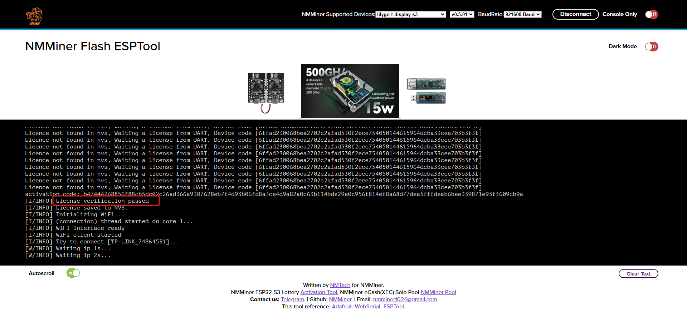
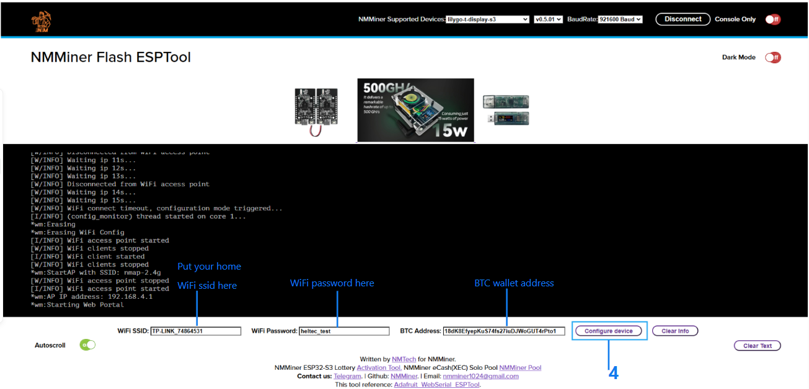
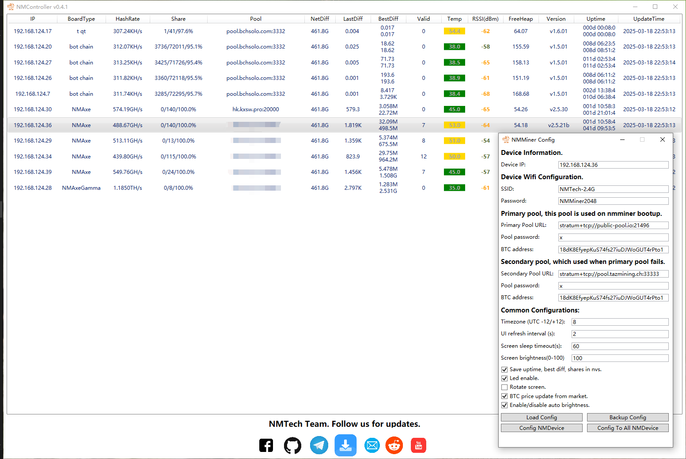

# NMMiner - New ESP32 Solo Miner
- BTC solo miner.
- 120kH/s with a single chip and maintaining low power consumption.
- Easy deployment with one click [NMMiner Flash Tool](https://flash.nmminer.com/).

## Requirements
- Boards with ESP32S3FN8 , ESP32S3R8 , ESP-WROOM-32 as so far.

## Features
- Deeply optimazation for ESP32-S3, max hashrate: 119 KH/s
- Deeply optimazation for ESP-WROOM-32, max hashrate: 92 KH/s
- NMController_client, [source code](https://github.com/NMminer1024/NMController_client), we put the *_x64.msi and *_x86.msi in tool folder already, just install, only for Windows
- NMController_web, [source code](https://github.com/NMminer1024/NMController_web), it's a Python implement, for Windows and Mac.

  <table width="100%">
    <tr>
      <td width="50%" align="center"></td>
      <td width="50%" align="center"></td>
    </tr>
  </table>

  <table width="100%">
    <tr>
      <td width="50%" align="center"></td>
      <td width="50%" align="center"></td>
    </tr>
  </table>

  <table width="100%">
    <tr>
      <td width="50%" align="center"></td>
      <td width="50%" align="center"></td>
    </tr>
  </table>

### Buttons
**Board with only one button**(binding to boot pin)

| Buttons           | Action             | Description             |
| :---------------  | :-----------------:|:-----------------:      |
|boot               | Long press         |  Miner Configuration  |
|boot               | Double click       |  switch to nexe screen page(if a screen in board)        |

**Board with two buttons**(binding to boot pin and a gpio pin)

| Buttons           | Action             | Description             |
| :---------------  | :-----------------:|:-----------------:      |
|boot               | Long press         |  Clear all status from nvs(if enabled this feature)  |
|boot               | Single click       |  Screen wake up(if a screen in board)         |
|boot               | Double click       |  Screen wake up(if a screen in board)         |
|user               | Single click       |  Screen wake up(if a screen in board)         |
|user               | Double click       |  Switch to next screen(if a screen in board)  |
|user               | [Press and hold before reset](#normal-configuration)  |  Miner Configuration    |

### NMMiner Configuration
***
#### Initiation configuration

1. When the device is powered on, it will connect to the last WiFi connected by default. If it fails to connect to this WiFi after trying for 15s, it will automatically enter the configuration mode.

2. Search for AP named: nmap-2.4g, enter password: 12345678

3.  If connect to AP via mobile phone and everything goes well, you will be redirected to the configuration page; if connect to AP via PC, just log in: 192.168.4.1.

  

4. You will see the following page. Follow the steps to configure your mining machine. The larger the UI refresh value, the higher the hash rate, and the hash rate will also increase when the screen is turned off.

  

5. You can return to the configuration page at any time and refer to the [button](#buttons) operations.

6. In some areas, the pool is blocked by the local firewall. If you have an SSL encrypted channel, you can enable this option.

7. When you click **Save** it will take a while (10-15 seconds), do not reset the miner manually, just let it restart automatically.

#### Force configuration

1. Press and hold the **User** button, then click the **Reset** button, wait until the QR code appears(screen board required), then release the **User** button.

2. Then follow [Initiation configuration](#Initiation-configuration)

  

***
#### Firmware update
 **Step 1**: Open [NMMiner Flash Tool](https://flash.nmminer.com/) in Chrome or Edge browser.

 **Step 2**: Choose the board and start the firmware update, **NMMiner Flash Tool** will pull the latest version from github, and configure the flash parameters automatically.
 

  

***Notice1:*** If you just update the latest firmware, that's all you need to do. if you are the first time flash the miner, [firmware activation](#Firmware-activation) is required. 

***Notice2:*** If you lost your licence, just use the [NMMiner Flash Tool](https://flash.nmminer.com/) flash your miner agin, the tool will send you a new one. 

#### Firmware activation 

 **Step 1**: After you flash the firmware, get the licence follow the guide.
 
 

  

 **Step 2**: Copy the the licence string back to licence code box, then click the button, you will see something exciting if everything goes well.
 
 

  

 **Step 3**:  If this is the first time you are flashing the miner, some basic and necessary configurations need to be set, just as below, certainly, you can config them via [Buttons](#Buttons).

 

  

 **Step 4**: Enjoy it!

## Pool
- Due to the very limited on-chip resources of the ESP32, some high-difficulty mining pools currently reject our connections. [public-pool.io](https://web.public-pool.io/) is a mining pool that accepts low-difficulty miners. We appreciate their efforts.

## How to monitor

- In fact, both ***NMController_client*** and ***NMController_web*** have the same feature, ***NMController_client*** for Windows, ***NMController_web*** for Windows and MACOS, We make an example by ***NMController_client*** here.

- ***NMController_client***, scan the machine in your LAN, just as below.

  

- Redirect to the web monitor for more details. 

  

  

##  Board support from latest version:
  - [Heltec Vision Master T190](https://www.aliexpress.us/item/1005007449552504.html)
  - [Heltec WiFi lora 32 v3](https://www.aliexpress.com/item/1005005443005152.html)
  - [Heltec wireless stick v3](https://heltec.org/project/wireless-stick-v3/)
  - [Heltec wireless stick lite v3](https://heltec.org/project/wireless-stick-lite-v2/)
  - [Heltec Wifi kit 32 v3](https://heltec.org/project/wifi-kit32-v3/)
  - Lilygo-T-Display-s3
  - Lilygo-T-Dongle-s3
  - NM-Bot-Chain-V1
  - NM-USB-Chain-V1
  - CYD(ESP32-2432S028R) with ILI9341 and ST7789 TFT driver.
## Contact
- We are committed to supporting more models of Arduino development boards.
- Anything do not work as your expectation, just let us know.

| Email                   |  Telegram                       |
| :-----------------:     |  :-----------------:            |
|nmminer1024@gmail.com    |  https://t.me/+IYFC1D0al1E5Yjdl |

## Release Log

### (2024.11.07) - v0.4.03
- Add:
  - Board support CYD(ESP32-2432S028R) with ILI9341 and ST7789 TFT driver, upto 92kH/s.
- Fixed:
  - Restart issues.
  - Shortage of lvgl heap.
- Improved:
  - None.
- Modify:
  - Remove firmware version in stratum protocol.
  - Update NMControler, Added column sorting.
- Baord support
  - [Heltec Vision Master T190](https://www.aliexpress.us/item/1005007449552504.html)
  - [Heltec WiFi lora 32 v3](https://www.aliexpress.com/item/1005005443005152.html)
  - [Heltec wireless stick v3](https://heltec.org/project/wireless-stick-v3/)
  - [Heltec wireless stick lite v3](https://heltec.org/project/wireless-stick-lite-v2/)
  - [Heltec Wifi kit 32 v3](https://heltec.org/project/wifi-kit32-v3/)
  - CYD(ESP32-2432S028R) with ILI9341 and ST7789 TFT driver.
  - Lilygo-T-Display-s3
  - Lilygo-T-Dongle-s3
  - NM-Bot-Chain-V1(Coming soon to sale)
  - NM-USB-Chain-V1(Coming soon to sale)

### (2024.10.29) - v0.4.02
- Add:
  - Board support Lilygo T Dongle s3
  - BTC market price(Disable default, enable this feature on config page)
- Fixed:
  - Miner reboot constantly.
- Improved:
  - UI
- Baord support
  - [Heltec Vision Master T190](https://www.aliexpress.us/item/1005007449552504.html)
  - [Heltec WiFi lora 32 v3](https://www.aliexpress.com/item/1005005443005152.html)
  - [Heltec wireless stick v3](https://heltec.org/project/wireless-stick-v3/)
  - [Heltec wireless stick lite v3](https://heltec.org/project/wireless-stick-lite-v2/)
  - [Heltec Wifi kit 32 v3](https://heltec.org/project/wifi-kit32-v3/)
  - Lilygo-T-Display-s3
  - Lilygo-T-Dongle-s3
  - NM-Bot-Chain-V1(Coming soon to sale)
  - NM-USB-Chain-V1(Coming soon to sale)

### (2024.10.21) - v0.4.01
- Add:
  - Board support NM Bot Chain V1
  - Board support NM USB Chain V1
  - Screen orientation option in configuration page.
- Fixed:
  - Valid block worng display, hashrate fall in worng state occasionally.
- Improved:
  - UI
- Baord support
  - [Heltec Vision Master T190](https://www.aliexpress.us/item/1005007449552504.html)
  - [Heltec WiFi lora 32 v3](https://www.aliexpress.com/item/1005005443005152.html)
  - [Heltec wireless stick v3](https://heltec.org/project/wireless-stick-v3/)
  - [Heltec wireless stick lite v3](https://heltec.org/project/wireless-stick-lite-v2/)
  - [Heltec Wifi kit 32 v3](https://heltec.org/project/wifi-kit32-v3/)
  - [All_usbcdc_screenless_esp32s3fn8](https://heltec.org/project/wifi-kit32-v3/)
  - Lilygo-T-Display-s3
  - NM-Bot-Chain-V1(Coming soon to sale)
  - NM-USB-Chain-V1(Coming soon to sale)

### (2024.10.08) - v0.3.04
- Add:
  - Board support Heltec Wireless Stick V3.
- Fixed:
  - None.
- Improved:
  - The initiation order.
- Baord support
  - [Heltec Vision Master T190](https://www.aliexpress.us/item/1005007449552504.html)
  - [Heltec WiFi lora 32 v3](https://www.aliexpress.com/item/1005005443005152.html)
  - [Heltec wireless stick v3](https://heltec.org/project/wireless-stick-v3/)
  - [Heltec wireless stick lite v3](https://heltec.org/project/wireless-stick-lite-v2/)
  - [Heltec Wifi kit 32 v3](https://heltec.org/project/wifi-kit32-v3/)
  - [All_usbcdc_screenless_esp32s3fn8](https://heltec.org/project/wifi-kit32-v3/)
  - Lilygo-T-Display-s3

### (2024.09.27) - v0.3.03
- Add:
  - Board support Lilygo-T-Display s3.
- Fixed:
  - Readme and structure of tool folder.
- Improved:
  - Loading screen.
- Baord support
  - [Heltec Vision Master T190](https://www.aliexpress.us/item/1005007449552504.html)
  - [Heltec WiFi lora 32 v3](https://www.aliexpress.com/item/1005005443005152.html)
  - [Heltec wireless stick lite v3](https://heltec.org/project/wireless-stick-lite-v2/)
  - [Heltec Wifi kit 32 v3](https://heltec.org/project/wifi-kit32-v3/)
  - [All_usbcdc_screenless_esp32s3fn8](https://heltec.org/project/wifi-kit32-v3/)
  - Lilygo-T-Display-s3

### (2024.09.23) - v0.3.02
- Add:
  - Web ESP-Tool.
  - Support chip, esp32fn8.
- Fixed:
  - None
- Improved:
  - None.
- Baord support
  - [Heltec Vision Master T190](https://www.aliexpress.us/item/1005007449552504.html)
  - [Heltec WiFi lora 32 v3](https://www.aliexpress.com/item/1005005443005152.html)
  - [Heltec wireless stick lite v3](https://heltec.org/project/wireless-stick-lite-v2/)
  - [Heltec Wifi kit 32 v3](https://heltec.org/project/wifi-kit32-v3/)
  - [all_usbcdc_screenless_esp32s3fn8](https://heltec.org/project/wifi-kit32-v3/)

### (2024.09.14) - v0.3.02
- Add:
  - License.
- Fixed:
  - None
- Improved:
  - Automatically enter configuration mode.
- Baord support
  - [Heltec Vision Master T190](https://www.aliexpress.us/item/1005007449552504.html)
  - [Heltec WiFi lora 32 v3](https://www.aliexpress.com/item/1005005443005152.html)
  - [Heltec wireless stick lite v3](https://heltec.org/project/wireless-stick-lite-v2/)
  - [Heltec Wifi kit 32 v3](https://heltec.org/project/wifi-kit32-v3/)

### (2024.09.08) - v0.3.01
- Add:
  - None
- Fixed:
  - Readme.md
- Improved:
  - None
- Baord support
  - [Heltec Vision Master T190](https://www.aliexpress.us/item/1005007449552504.html)
  - [Heltec WiFi lora 32 v3](https://www.aliexpress.com/item/1005005443005152.html)

### (2024.09.02) - v0.3.01
- Add:
  - Tool, [***NMController***](https://github.com/NMminer1024/NMController), Something like a LAN centralized monitoring client, Windows 10 or higher require.
  - Firmware, mining status broadcast to LAN. 
- Fixed:
  - None
- Improved:
  - None
- Baord support
  - [Heltec Vision Master T190](https://www.aliexpress.us/item/1005007449552504.html)
  - [Heltec WiFi lora 32 v3](https://www.aliexpress.com/item/1005005443005152.html)

### (2024.09.02) - v0.2.13
- Add:
  - None
- Fixed:
  - License disappear issue when return to configuration page.
- Improved:
  - None
- Baord support
  - [Heltec Vision Master T190](https://www.aliexpress.us/item/1005007449552504.html)
  - [Heltec WiFi lora 32 v3](https://www.aliexpress.com/item/1005005443005152.html)

### (2024.08.31) - v0.2.12
- Add:
  - None
- Fixed:
  - Device would occasionally restart frequently when connecting to WiFi at startup.
- Improved:
  - None
- Baord support
  - [Heltec Vision Master T190](https://www.aliexpress.us/item/1005007449552504.html)
  - [Heltec WiFi lora 32 v3](https://www.aliexpress.com/item/1005005443005152.html)

### (2024.08.27) - v0.2.11
- Add:
  - Web Monitor, makes it easy to monitor your machine without any special client tools. You only need a phone or computer's browser.
  - Heltec WiFi lora 32 v3 firmware
- Fixed:
  - Some issues from WiFi.
- Improved:
  - Memory management.
  - Almost reaching 120KH/s when USB CDC disable.
- Baord support
  - [Heltec Vision Master T190](https://www.aliexpress.us/item/1005007449552504.html)
  - [Heltec WiFi lora 32 v3](https://www.aliexpress.com/item/1005005443005152.html)
- Next
  - Some screenless board support.

### (2024.08.15) - v0.2.10
- Features:
  - BTC solo miner base on esp32s3 series 
  - Up to **118kH/s** 
  - ssl connection support
  - Screen auto off in 60s
  - Real time clock
  - Configuration on websever, it's easy enough to build your first BTC Miner.
  - WiFi signal strength on screen.
- Fixed:
  - Memory leak issues.
  - Stratum nBits sector parse issues.
- Modify:
  - None
- Baord support
  - [Heltec Vision Master T190](https://www.aliexpress.us/item/1005007449552504.html)

### (2024.08.13) - v0.2.02
- Features:
  - BTC solo miner base on esp32s3 series 
  - Up to **118kH/s** 
  - ssl connection support
  - Screen auto off in 60s
  - Real time clock
  - Configuration on websever, it's easy enough to build your first BTC Miner.
  - WiFi signal strength on screen.
- Fixed:
  - Mining status clean issues.
- Modify:
  - None
- Baord support
  - [Heltec Vision Master T190](https://www.aliexpress.us/item/1005007449552504.html)

### (2024.08.10) - v0.2.01
- Features:
  - BTC solo miner base on esp32s3 series 
  - Up to **118kH/s** 
  - ssl connection support
  - Screen auto off in 60s
  - Real time clock
  - Configuration on websever, it's easy enough to build your first BTC Miner.
  - WiFi signal strength on screen.
- Fixed:
  - **Configuration of user BTC address not effective issue.**
- Modify:
  - Contact us, telegram group add.
  - Modify firmware update tools, make it easy to update firmware.
- Baord support
  - [Heltec Vision Master T190](https://www.aliexpress.us/item/1005007449552504.html)

### (2024.08.09) - v0.1.55
- Features:
  - BTC solo miner base on esp32s3 series 
  - Up to **118kH/s** 
  - ssl connection support
  - Screen auto off in 60s
  - Real time clock
  - Configuration on websever, it's easy enough to build your first BTC Miner.
  - WiFi signal strength on screen.
- Fixed:
  - Some ssl issues.
- Modify:
  - Add some log on loading screen.
  - Hashrate upto 118K when screen off.
- Baord support
  - [Heltec Vision Master T190](https://www.aliexpress.us/item/1005007449552504.html)

### (2024.08.02) - v0.1.54
- Features:
  - BTC solo miner base on esp32s3 series 
  - Up to **117kH/s** 
  - ssl connection support
  - Screen auto off in 60s
  - Real time clock
  - Configuration on websever, it's easy enough to build your first BTC Miner.
  - WiFi Signal Strength add.
- Fixed:
  - Some issues after full chip erase.
- Modify:
  - None
- Baord support
  - [Heltec Vision Master T190](https://www.aliexpress.us/item/1005007449552504.html)

### (2024.08.01) - v0.1.53
- Features:
  - BTC solo miner base on esp32s3 series 
  - Up to **117kH/s** 
  - ssl connection support
  - Screen auto off in 60s
  - Real time clock
  - Configuration on websever, it's easy enough to build your first BTC Miner.
  - WiFi Signal Strength add.
- Fixed:
  - Fixed default WiFi parameters issues.
  - Fixed parameter of 'screen off time out'.
- Modify:
  - Some nvs handles, not compatible with v0.1.52.
- Baord support
  - [Heltec Vision Master T190](https://www.aliexpress.us/item/1005007449552504.html)

### (2024.07.31) - v0.1.52
- Features:
  - BTC solo miner base on esp32s3 series 
  - Up to **117kH/s** 
  - ssl connection support
  - Screen auto off in 60s, can be setted from the Configuration Page
  - Real-time clock
  - Configuration on webserver, it's easy enough to build your first BTC Miner.
- Fixed:
  - First push 
- Modify:
  - None
- Board support
  - [Heltec Vision Master T190](https://www.aliexpress.us/item/1005007449552504.html)
